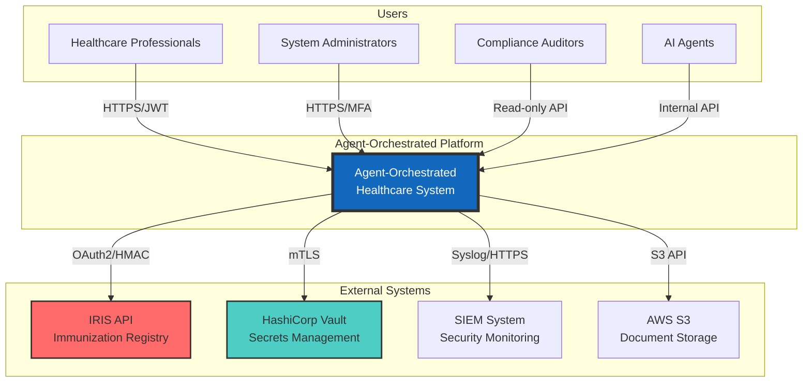
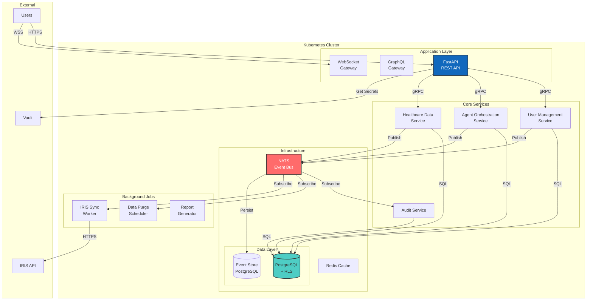
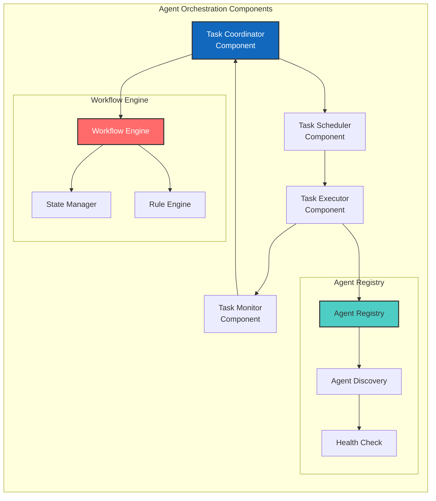
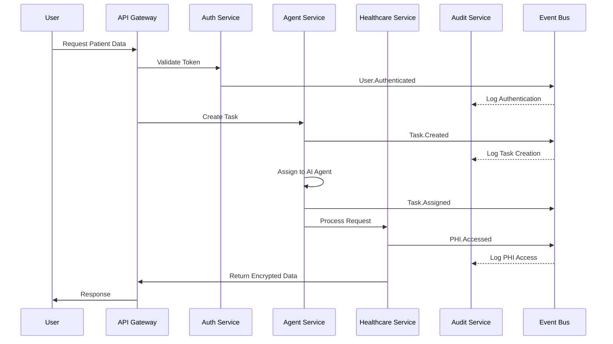
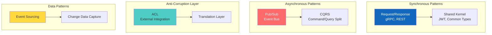
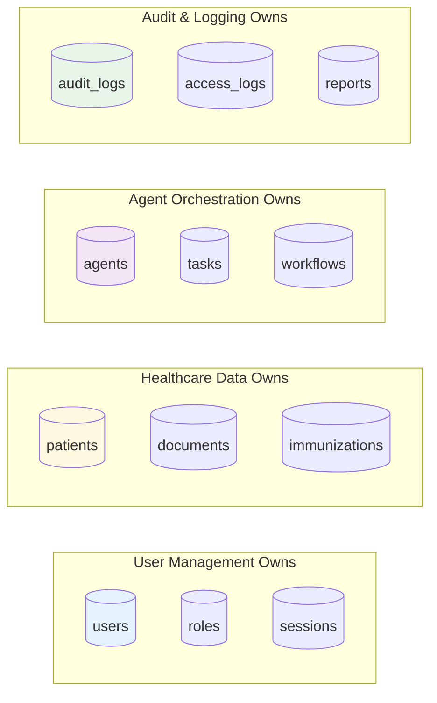
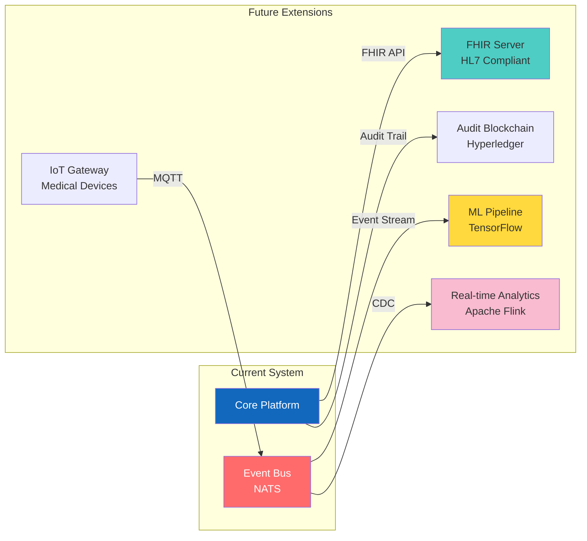

# Context Map - Agent-Orchestrated Healthcare Platform

## 1. Введение

Данный документ представляет архитектурную карту контекстов (Context Map) для платформы "Agent-Orchestrated App" - высокомодульной системы управления медицинскими данными с продакшн-уровнем безопасности. Документ следует принципам Domain-Driven Design (DDD), использует нотацию C4 Model для визуализации и Event Storming для моделирования событийных потоков.

**Цель документа**: Определить четкие границы между модулями системы, их взаимодействие и точки интеграции для обеспечения высокой модульности, аудируемости и безопасности уровня production.

**Связанная документация**:
- `project_spec.yaml` - высокоуровневое описание проекта
- `event_contracts.yaml` - контракты событий системы
- `secure_pipeline.yml` - CI/CD конфигурация

## 2. Перечень Bounded Contexts

### 2.1 User Management Context

**Ответственность**: Управление пользователями, аутентификация, авторизация, управление доступом на основе ролей (RBAC)

**Основные бизнес-объекты**:
- **User** (Aggregate Root)
  - UserId (Value Object)
  - Email (Value Object)
  - PasswordHash (Value Object)
  - MFAConfiguration (Value Object)
  - AccountStatus (Value Object)
- **Role** (Aggregate Root)
  - RoleId (Value Object)
  - RoleName (Value Object)
  - Permissions (Value Object Collection)
- **Session** (Aggregate Root)
  - SessionToken (Value Object)
  - UserId (Value Object)
  - ExpirationTime (Value Object)
  - IPAddress (Value Object)

### 2.2 Agent Orchestration Context

**Ответственность**: Управление AI-агентами, оркестрация задач, координация выполнения

**Основные бизнес-объекты**:
- **Agent** (Aggregate Root)
  - AgentId (Value Object)
  - AgentType (Value Object)
  - Capabilities (Value Object Collection)
  - Status (Value Object)
- **Task** (Aggregate Root)
  - TaskId (Value Object)
  - TaskDefinition (Entity)
  - ExecutionPlan (Value Object)
  - Priority (Value Object)
- **Workflow** (Aggregate Root)
  - WorkflowId (Value Object)
  - Steps (Entity Collection)
  - ExecutionState (Value Object)

### 2.3 Healthcare Data Context

**Ответственность**: Управление медицинскими данными, соответствие FHIR стандартам, обработка PHI/PII

**Основные бизнес-объекты**:
- **Patient** (Aggregate Root)
  - PatientId (Value Object)
  - Demographics (Entity) - encrypted
  - ConsentStatus (Value Object)
  - MedicalRecordNumber (Value Object)
- **ClinicalDocument** (Aggregate Root)
  - DocumentId (Value Object)
  - DocumentType (Value Object)
  - EncryptedContent (Value Object)
  - Metadata (Entity)
- **Immunization** (Entity)
  - VaccineCode (Value Object)
  - AdministrationDate (Value Object)
  - Provider (Value Object)

### 2.4 Audit & Logging Context

**Ответственность**: Неизменяемое логирование всех операций, соответствие SOC2/HIPAA, формирование отчетности

**Основные бизнес-объекты**:
- **AuditLog** (Aggregate Root)
  - LogId (Value Object)
  - Timestamp (Value Object)
  - EventType (Value Object)
  - ActorId (Value Object)
  - ResourceId (Value Object)
  - HashChain (Value Object) - для целостности
- **ComplianceReport** (Aggregate Root)
  - ReportId (Value Object)
  - ReportPeriod (Value Object)
  - Metrics (Entity Collection)
- **AccessLog** (Entity)
  - AccessTime (Value Object)
  - ResourceAccessed (Value Object)
  - AccessResult (Value Object)

### 2.5 Integration Context

**Ответственность**: Интеграция с внешними системами (IRIS API), управление API подключениями

**Основные бизнес-объекты**:
- **APIEndpoint** (Aggregate Root)
  - EndpointId (Value Object)
  - URL (Value Object)
  - AuthConfiguration (Entity)
  - RateLimitPolicy (Value Object)
- **APICredentials** (Aggregate Root)
  - CredentialId (Value Object)
  - EncryptedSecret (Value Object)
  - ExpirationDate (Value Object)
- **IntegrationRequest** (Entity)
  - RequestId (Value Object)
  - Status (Value Object)
  - RetryCount (Value Object)

### 2.6 Data Retention Context

**Ответственность**: Управление жизненным циклом данных, автоматическое удаление, соблюдение политик хранения

**Основные бизнес-объекты**:
- **RetentionPolicy** (Aggregate Root)
  - PolicyId (Value Object)
  - DataType (Value Object)
  - RetentionPeriod (Value Object)
  - PurgeStrategy (Value Object)
- **PurgeExecution** (Aggregate Root)
  - ExecutionId (Value Object)
  - ScheduledTime (Value Object)
  - AffectedRecords (Value Object Collection)
- **RetentionOverride** (Entity)
  - OverrideReason (Value Object)
  - ApprovalStatus (Value Object)

### 2.7 Security & Encryption Context

**Ответственность**: Шифрование данных, управление ключами, криптографические операции

**Основные бизнес-объекты**:
- **EncryptionKey** (Aggregate Root)
  - KeyId (Value Object)
  - KeyVersion (Value Object)
  - Algorithm (Value Object)
  - RotationSchedule (Value Object)
- **EncryptedData** (Entity)
  - DataId (Value Object)
  - CipherText (Value Object)
  - EncryptionMetadata (Value Object)

## 3. C4 Diagrams

### 3.1 Level 1: System Context Diagram



### 3.2 Level 2: Container Diagram



### 3.3 Component Diagram - Agent Orchestration Context



## 4. Событийная модель (Event Storming)

### 4.1 Основные доменные события

| Событие | Источник | Подписчики | Описание |
|---------|----------|------------|----------|
| **User.Created** | User Management | Audit, Agent Orchestration | Создан новый пользователь |
| **User.Authenticated** | User Management | Audit, Session Manager | Успешная аутентификация |
| **User.RoleAssigned** | User Management | Audit, Access Control | Назначена роль пользователю |
| **User.Deactivated** | User Management | All Contexts | Деактивация учетной записи |
| **Agent.Registered** | Agent Orchestration | Audit, Task Scheduler | Регистрация нового агента |
| **Task.Created** | Agent Orchestration | Task Queue, Audit | Создана новая задача |
| **Task.Assigned** | Agent Orchestration | Agent, Monitor | Задача назначена агенту |
| **Task.Completed** | Agent Orchestration | Workflow Engine, Audit | Задача выполнена |
| **Workflow.Started** | Agent Orchestration | Task Scheduler, Audit | Запущен рабочий процесс |
| **Patient.Created** | Healthcare Data | Audit, Data Retention | Создана карта пациента |
| **PHI.Accessed** | Healthcare Data | Audit, Compliance | Доступ к PHI данным |
| **Document.Uploaded** | Healthcare Data | Encryption, Audit | Загружен медицинский документ |
| **Immunization.Recorded** | Healthcare Data | IRIS Sync, Audit | Записана информация о прививке |
| **Data.Encrypted** | Security | Audit | Данные зашифрованы |
| **Key.Rotated** | Security | All Contexts | Ротация ключа шифрования |
| **Audit.LogCreated** | Audit | Event Store, SIEM | Создана запись аудита |
| **Compliance.ReportGenerated** | Audit | Storage, Notification | Сгенерирован отчет соответствия |
| **Integration.RequestSent** | Integration | Audit, Monitoring | Отправлен запрос к внешней системе |
| **Integration.ResponseReceived** | Integration | Processing Queue, Audit | Получен ответ от внешней системы |
| **RetentionPolicy.Applied** | Data Retention | Purge Scheduler | Применена политика хранения |
| **Data.Purged** | Data Retention | Audit, Compliance | Данные удалены |

### 4.2 Событийная цепочка примера



## 5. Взаимодействия между контекстами

### 5.1 Матрица взаимодействий

| Источник | Целевой контекст | Тип | Протокол | Паттерн | Описание |
|----------|------------------|-----|----------|---------|----------|
| User Management | Audit & Logging | Async | Event Bus | Pub/Sub | Все события пользователей |
| User Management | All Contexts | Sync | JWT | Shared Kernel | Контекст безопасности |
| Agent Orchestration | Healthcare Data | Sync | gRPC | Customer/Supplier | Обработка медданных |
| Agent Orchestration | Audit & Logging | Async | Event Bus | Pub/Sub | Логирование операций |
| Healthcare Data | Security & Encryption | Sync | Internal API | ACL | Шифрование PHI |
| Healthcare Data | Integration | Async | Event Bus | Pub/Sub | Синхронизация с IRIS |
| Integration | External Systems | Sync | REST/SOAP | ACL | Внешние вызовы |
| Data Retention | Healthcare Data | Async | Event Bus | Pub/Sub | Удаление данных |
| Security & Encryption | All Contexts | Sync | Internal API | Shared Kernel | Крипто-операции |
| All Contexts | Audit & Logging | Async | Event Bus | Pub/Sub | Аудит всех операций |

### 5.2 Диаграмма интеграционных паттернов



## 6. Границы и ограничения

### 6.1 Границы транзакций

| Контекст | Scope | Consistency Model | Isolation Level |
|----------|-------|-------------------|-----------------|
| User Management | Per Aggregate | Strong Consistency | Read Committed |
| Agent Orchestration | Per Workflow | Eventual Consistency | Read Committed |
| Healthcare Data | Per Patient | Strong Consistency | Serializable |
| Audit & Logging | Append-Only | Eventual Consistency | Read Uncommitted |
| Integration | Per Request | At-Least-Once | Read Committed |
| Data Retention | Batch Operation | Eventual Consistency | Read Committed |

### 6.2 Data Ownership



### 6.3 Security Boundaries

**Row Level Security (RLS)**:
```sql
-- Пример политики для таблицы patients
CREATE POLICY patient_isolation ON patients
    FOR ALL 
    TO application_user
    USING (tenant_id = current_setting('app.current_tenant_id')::uuid);
```

**Encryption Boundaries**:
- **At Rest**: AES-256-GCM для всех PHI/PII полей
- **In Transit**: TLS 1.3 минимум для всех соединений
- **Field Level**: Детерминированное шифрование для поисковых полей

**Network Segmentation**:
```mermaid
graph TB
    subgraph "DMZ"
        LB[Load Balancer]
        WAF[Web Application Firewall]
    end
    
    subgraph "Application Tier"
        API[API Services]
        Bus[Event Bus]
    end
    
    subgraph "Data Tier"
        DB[(PostgreSQL)]
        Cache[(Redis)]
    end
    
    LB --> API
    API --> Bus
    API --> DB
    API --> Cache
    
    style DMZ fill:#ffcdd2
    style "Application Tier" fill:#fff9c4
    style "Data Tier" fill:#c8e6c9
```

## 7. Рекомендации по расширению

### 7.1 Масштабирование контекстов

**Горизонтально масштабируемые**:
1. **Agent Orchestration** - stateless агенты, партиционирование по типу задач
2. **Integration Context** - множественные инстансы с load balancing
3. **Audit & Logging** - партиционирование по времени

**Вертикально масштабируемые**:
1. **Healthcare Data** - требует тщательного шардирования по patient_id
2. **Security & Encryption** - ограничено производительностью HSM

### 7.2 Точки расширения



### 7.3 Миграционная стратегия

**Phase 1 - Извлечение сервисов** (0-6 месяцев):
- Integration Context → отдельный микросервис
- Audit & Logging → отдельный сервис с собственной БД

**Phase 2 - Декомпозиция данных** (6-12 месяцев):
- Разделение схем БД по контекстам
- Внедрение Saga pattern для распределенных транзакций

**Phase 3 - Полная автономия** (12+ месяцев):
- Каждый контекст как отдельный deployment
- Service mesh для управления коммуникациями

**Подготовительные шаги**:
- ✅ Event Bus уже готов для асинхронной коммуникации
- ✅ Четкие границы контекстов определены
- ✅ API Gateway для единой точки входа
- 🔄 Необходимо внедрить distributed tracing
- 🔄 Подготовить схемы БД к разделению

---

*Сгенерировано Claude Opus 4 — 2024-12-27 15:45:00 UTC*