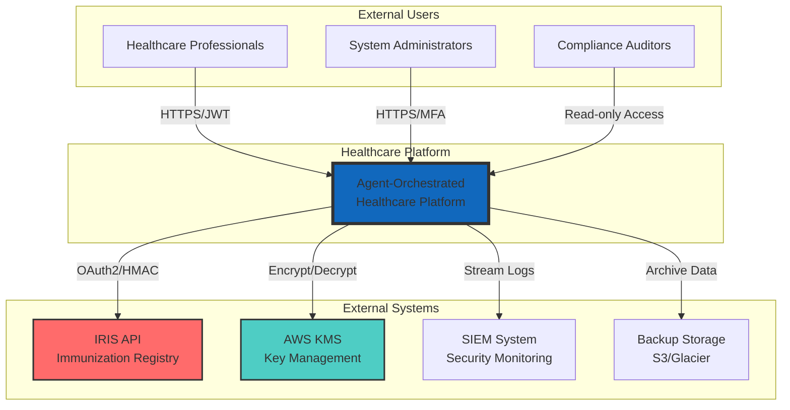
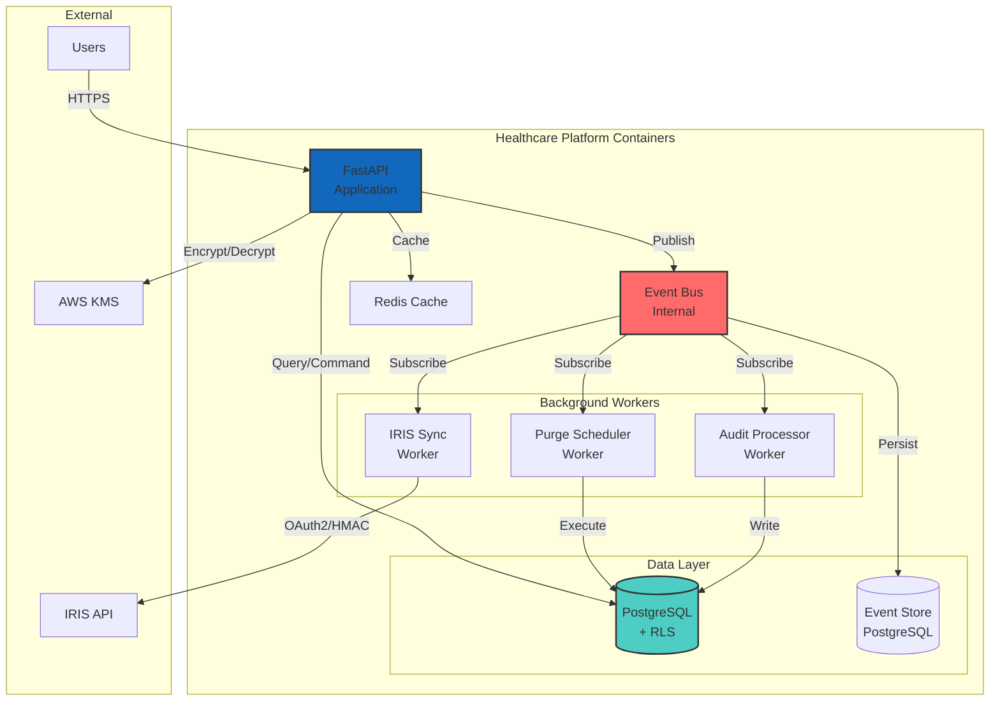
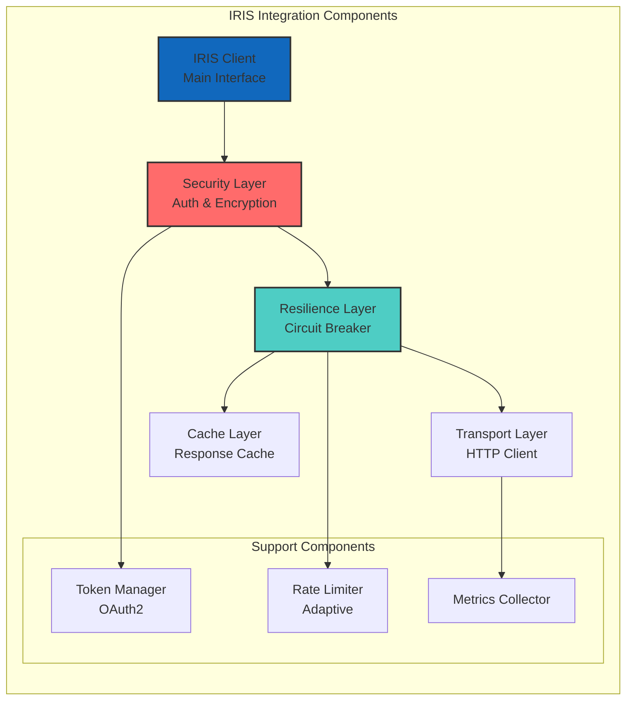
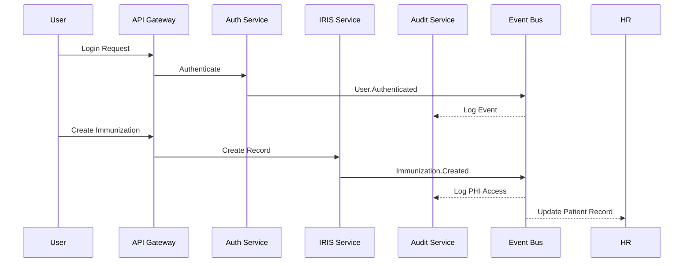
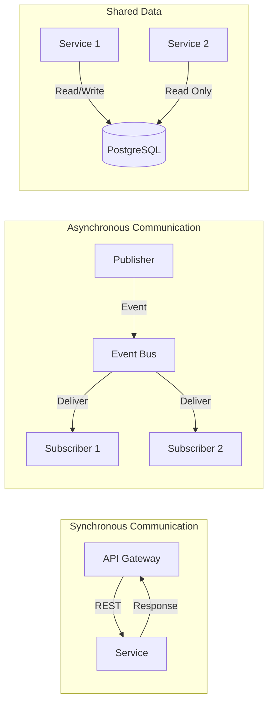
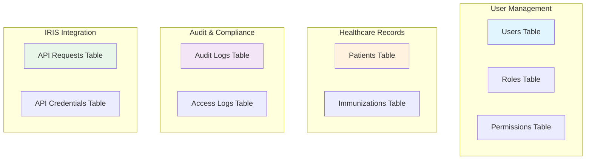
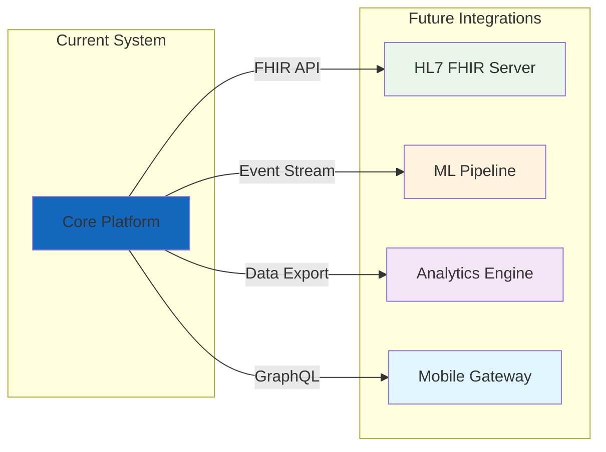

# Context Map - Agent-Orchestrated Healthcare Platform

## 1. Введение

Данный документ описывает архитектурную карту контекстов (Context Map) для платформы оркестрации AI-агентов в сфере здравоохранения. Документ следует принципам Domain-Driven Design (DDD) и использует нотацию C4 Model для визуализации архитектуры.

**Цель документа**: Определить границы ответственности между модулями системы, их взаимодействие и точки интеграции для обеспечения высокой модульности, безопасности и соответствия требованиям SOC2/HIPAA.

**Связанные документы**: 
- `project_spec.yaml` - высокоуровневое описание проекта
- `threat_model.md` - модель угроз безопасности
- `database_schema.sql` - схема базы данных

## 2. Перечень Bounded Contexts

### 2.1 User & Access Management Context

**Ответственность**: Управление пользователями, аутентификация, авторизация, RBAC

**Основные агрегаты**:
- **User** (Aggregate Root)
  - UserId (VO)
  - Credentials (VO)
  - MFASettings (VO)
  - LoginHistory (Entity)
- **Role** (Aggregate Root)
  - RoleId (VO)
  - Permissions (VO)
  - HierarchicalStructure (VO)
- **Session** (Aggregate Root)
  - SessionToken (VO)
  - ExpiryPolicy (VO)

### 2.2 IRIS Integration Context

**Ответственность**: Интеграция с внешними медицинскими системами (IRIS API), управление иммунизационными записями

**Основные агрегаты**:
- **ImmunizationRecord** (Aggregate Root)
  - FHIR R4 Resource (VO)
  - PatientReference (VO)
  - VaccineCode (VO)
- **APIEndpoint** (Aggregate Root)
  - EndpointConfig (VO)
  - RateLimitPolicy (VO)
  - CircuitBreakerState (VO)
- **IntegrationCredentials** (Aggregate Root)
  - EncryptedCredentials (VO)
  - RotationSchedule (VO)

### 2.3 Audit & Compliance Context

**Ответственность**: SOC2/HIPAA-совместимое логирование, неизменяемый audit trail, compliance отчетность

**Основные агрегаты**:
- **AuditLog** (Aggregate Root)
  - LogEntry (VO) - immutable
  - HashChain (VO)
  - ComplianceTags (VO)
- **ComplianceReport** (Aggregate Root)
  - ReportPeriod (VO)
  - Metrics (VO)
  - Attestations (Entity)

### 2.4 Data Retention & Purge Context

**Ответственность**: Управление жизненным циклом данных, автоматическое удаление, legal holds

**Основные агрегаты**:
- **RetentionPolicy** (Aggregate Root)
  - RetentionRules (VO)
  - PurgeStrategy (VO)
- **PurgeExecution** (Aggregate Root)
  - ExecutionPlan (VO)
  - PurgeResults (VO)
- **RetentionOverride** (Aggregate Root)
  - OverrideReason (VO)
  - ApprovalWorkflow (Entity)

### 2.5 Healthcare Records Context

**Ответственность**: Управление PHI/PII данными пациентов, соответствие FHIR стандартам

**Основные агрегаты**:
- **Patient** (Aggregate Root)
  - EncryptedPHI (VO)
  - ConsentStatus (VO)
  - MedicalRecordNumber (VO)
- **ClinicalDocument** (Aggregate Root)
  - DocumentMetadata (VO)
  - EncryptedContent (VO)
  - AccessControl (VO)

### 2.6 Encryption & Security Context

**Ответственность**: Шифрование данных, управление ключами, криптографические операции

**Основные агрегаты**:
- **EncryptionKey** (Aggregate Root)
  - KeyMaterial (VO) - encrypted
  - KeyRotationPolicy (VO)
  - KeyUsageAudit (Entity)
- **EncryptedField** (Aggregate Root)
  - FieldRegistry (VO)
  - EncryptionMetadata (VO)

### 2.7 Event Processing Context

**Ответственность**: Асинхронная обработка событий, гарантии доставки, event sourcing

**Основные агрегаты**:
- **Event** (Aggregate Root)
  - EventPayload (VO)
  - EventMetadata (VO)
  - DeliveryGuarantee (VO)
- **EventSubscription** (Aggregate Root)
  - SubscriberConfig (VO)
  - RetryPolicy (VO)
  - DeadLetterQueue (VO)

### 2.8 Configuration Management Context

**Ответственность**: Управление конфигурацией системы, feature flags, environment-specific настройки

**Основные агрегаты**:
- **Configuration** (Aggregate Root)
  - ConfigValue (VO)
  - ValidationRules (VO)
  - VersionHistory (Entity)
- **FeatureFlag** (Aggregate Root)
  - ToggleRules (VO)
  - RolloutStrategy (VO)

## 3. C4 Diagrams

### 3.1 Level 1: System Context Diagram

### 3.2 Level 2: Container Diagram

### 3.3 Component Diagram - IRIS Integration Context

## 4. Событийная модель (Event Storming)

### 4.1 Основные доменные события

| Событие | Публикует | Подписчики | Описание |
|---------|-----------|------------|----------|
| **User.Created** | User Management | Audit, Event Store | Новый пользователь создан |
| **User.Authenticated** | User Management | Audit, Session Manager | Успешная аутентификация |
| **User.LockedOut** | User Management | Audit, Security Alert | Блокировка после неудачных попыток |
| **Role.Assigned** | User Management | Audit, Access Control | Роль назначена пользователю |
| **Immunization.Created** | IRIS Integration | Healthcare Records, Audit | Новая запись о прививке |
| **Immunization.Updated** | IRIS Integration | Healthcare Records, Audit | Обновление записи |
| **IRIS.SyncCompleted** | IRIS Integration | Healthcare Records | Синхронизация завершена |
| **CircuitBreaker.Opened** | IRIS Integration | Monitoring, Alert System | Прерыватель открыт |
| **PHI.Accessed** | Healthcare Records | Audit, Compliance | Доступ к PHI данным |
| **PHI.Encrypted** | Encryption | Audit | Данные зашифрованы |
| **Key.Rotated** | Encryption | All Contexts | Ротация ключа шифрования |
| **RetentionPolicy.Applied** | Data Retention | Purge Worker | Применена политика хранения |
| **Data.Purged** | Data Retention | Audit, Compliance | Данные удалены |
| **PurgeOverride.Created** | Data Retention | Audit, Approval Workflow | Создано исключение для удаления |
| **Audit.LogCreated** | Audit Context | Event Store, SIEM | Создана запись аудита |
| **Compliance.ReportGenerated** | Audit Context | Storage, Notification | Сгенерирован отчет |
| **Config.Changed** | Configuration | All Contexts | Изменена конфигурация |
| **FeatureFlag.Toggled** | Configuration | Affected Contexts | Переключен feature flag |

### 4.2 Событийные потоки (Event Flows)

## 5. Взаимодействия между контекстами

### 5.1 Матрица взаимодействий

| Источник | Целевой контекст | Тип интеграции | Протокол | Описание |
|----------|------------------|----------------|----------|----------|
| User Management | Audit | Event | Event Bus | Все действия пользователей |
| User Management | All Contexts | Sync | JWT Token | Контекст пользователя |
| IRIS Integration | Healthcare Records | Event | Event Bus | Синхронизация данных |
| IRIS Integration | Encryption | Sync | Internal API | Шифрование PHI |
| Healthcare Records | Encryption | Sync | Internal API | Шифрование/дешифрование |
| Healthcare Records | Audit | Event | Event Bus | Доступ к PHI |
| Data Retention | Healthcare Records | Async | Event Bus | Удаление данных |
| Data Retention | Audit | Event | Event Bus | Логирование удалений |
| Configuration | All Contexts | Event | Event Bus | Изменения конфигурации |
| All Contexts | Event Processing | Event | Event Bus | Публикация событий |

### 5.2 Паттерны интеграции

## 6. Границы и ограничения

### 6.1 Границы транзакций

| Контекст | Граница транзакции | Consistency Model |
|----------|-------------------|-------------------|
| User Management | Per aggregate (User, Role) | Strong consistency |
| IRIS Integration | Per API call | Eventual consistency |
| Healthcare Records | Per patient record | Strong consistency |
| Audit | Append-only, no transactions | Eventual consistency |
| Data Retention | Batch operations | Eventual consistency |

### 6.2 Data Ownership

### 6.3 Security Boundaries

**Row Level Security (RLS)**:
- Patients таблица: доступ только к записям своей организации
- Audit logs: read-only для всех кроме системы
- API credentials: доступ только для service accounts

**Encryption Boundaries**:
- At rest: все PHI/PII поля в PostgreSQL
- In transit: TLS 1.3 для всех соединений
- Field-level: отдельное шифрование для sensitive данных

**Network Boundaries**:
- Internal services: private subnet
- External APIs: через API Gateway с WAF
- Database: изолированная subnet с security groups

## 7. Рекомендации по расширению

### 7.1 Масштабирование контекстов

**Легко масштабируемые**:
1. **IRIS Integration** - stateless, можно добавлять инстансы
2. **Audit Processing** - партиционирование по времени
3. **Event Processing** - горизонтальное масштабирование workers

**Требуют планирования**:
1. **Healthcare Records** - sharding по patient ID
2. **User Management** - кеширование сессий в Redis

### 7.2 Точки расширения

### 7.3 Рекомендации по миграции к микросервисам

**Приоритет выделения** (от высокого к низкому):
1. IRIS Integration → отдельный сервис
2. Audit & Compliance → отдельный сервис
3. Data Retention → background job service
4. Healthcare Records → остается в монолите дольше всего

**Подготовка**:
- Все контексты уже имеют четкие границы
- Event Bus готов для межсервисной коммуникации
- База данных подготовлена для разделения (отдельные схемы)

---

*Сгенерировано Claude Opus 4 — 2024-12-27 14:30:00 UTC*