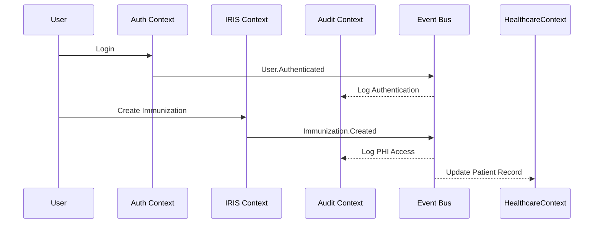

# Domain-Driven Design Architecture Guide

## Overview

This document provides an English summary of the Domain-Driven Design (DDD) architecture for the Agent-Orchestrated Healthcare Platform, mapping the bounded contexts to the existing codebase structure.

## Bounded Contexts Mapping

### Current Codebase → DDD Context Alignment

| Existing Module | DDD Bounded Context | Primary Responsibilities |
|----------------|--------------------|-----------------------|
| `app/modules/auth/` | **User & Access Management Context** | Authentication, authorization, RBAC, session management |
| `app/modules/iris_api/` | **IRIS Integration Context** | External API integration, immunization records, circuit breaker |
| `app/modules/audit_logger/` | **Audit & Compliance Context** | SOC2/HIPAA logging, immutable audit trail, compliance reporting |
| `app/modules/purge_scheduler/` | **Data Retention & Purge Context** | Data lifecycle management, automated deletion, legal holds |
| `app/core/event_bus_advanced.py` | **Event Processing Context** | Asynchronous event processing, delivery guarantees, event sourcing |
| `app/core/security.py` | **Encryption & Security Context** | Data encryption, key management, cryptographic operations |
| `app/core/config.py` | **Configuration Management Context** | System configuration, feature flags, environment settings |
| **[Future Module]** | **Healthcare Records Context** | PHI/PII management, FHIR compliance, patient data |

## Aggregate Design Patterns

### 1. User & Access Management Context

**Current Implementation**: `app/modules/auth/`

**Key Aggregates**:
- **User** (Aggregate Root)
  - Identity management
  - Credential validation
  - MFA settings
  - Login history tracking

- **Role** (Aggregate Root)
  - Permission sets
  - Hierarchical structure
  - Access control rules

**Domain Events**:
- `User.Created`
- `User.Authenticated`  
- `User.LockedOut`
- `Role.Assigned`

### 2. IRIS Integration Context

**Current Implementation**: `app/modules/iris_api/`

**Key Aggregates**:
- **ImmunizationRecord** (Aggregate Root)
  - FHIR R4 resource compliance
  - Patient references
  - Vaccine coding

- **APIEndpoint** (Aggregate Root)
  - Endpoint configuration
  - Rate limiting policies
  - Circuit breaker state

**Domain Events**:
- `Immunization.Created`
- `Immunization.Updated`
- `IRIS.SyncCompleted`
- `CircuitBreaker.Opened`

### 3. Audit & Compliance Context

**Current Implementation**: `app/modules/audit_logger/`

**Key Aggregates**:
- **AuditLog** (Aggregate Root)
  - Immutable log entries
  - Hash chain verification
  - Compliance tagging

- **ComplianceReport** (Aggregate Root)
  - Reporting periods
  - Metrics collection
  - Attestation tracking

**Domain Events**:
- `Audit.LogCreated`
- `Compliance.ReportGenerated`

### 4. Healthcare Records Context (Future)

**Proposed Implementation**: `app/modules/healthcare_records/`

**Key Aggregates**:
- **Patient** (Aggregate Root)
  - Encrypted PHI/PII
  - Consent management
  - Medical record numbers

- **ClinicalDocument** (Aggregate Root)
  - Document metadata
  - Encrypted content
  - Access controls

**Domain Events**:
- `PHI.Accessed`
- `Patient.ConsentUpdated`
- `ClinicalDocument.Created`

## Event-Driven Architecture

### Event Bus Implementation

**Current**: `app/core/event_bus_advanced.py`

**Features**:
- Memory-first processing with PostgreSQL durability
- At-least-once delivery guarantees
- Per-aggregate ordering
- Circuit breaker per subscriber
- Dead letter queue handling

### Key Domain Events Flow



## Context Integration Patterns

### 1. Synchronous Integration
- **Use Case**: Real-time data validation, authentication
- **Implementation**: Direct service calls within same process
- **Example**: Auth context validating user tokens

### 2. Asynchronous Integration
- **Use Case**: Cross-context notifications, eventual consistency
- **Implementation**: Event Bus with domain events
- **Example**: IRIS sync triggering audit logging

### 3. Shared Database
- **Use Case**: Transactional consistency within bounded context
- **Implementation**: PostgreSQL with Row Level Security (RLS)
- **Example**: User and Role aggregates sharing auth schema

## Security Boundaries

### Data Encryption Boundaries

| Context | Encryption Strategy | Key Management |
|---------|-------------------|----------------|
| Healthcare Records | Field-level AES-256 | AWS KMS rotation |
| IRIS Integration | Request/response encryption | HMAC + OAuth2 |
| Audit & Compliance | Hash chain integrity | Immutable logging |
| User Management | Password hashing | bcrypt + salt |

### Access Control Boundaries

- **Row Level Security (RLS)**: Implemented at database level
- **JWT Token Scope**: Context-aware permissions
- **API Rate Limiting**: Per-context rate limits
- **Network Segmentation**: Service isolation

## Migration Strategy to Microservices

### Phase 1: Context Isolation (Current)
- ✅ Clear module boundaries established
- ✅ Event bus for cross-context communication
- ✅ Separate database schemas per context

### Phase 2: Service Extraction (Future)

**Priority Order**:
1. **IRIS Integration Context** → Stateless, external dependency
2. **Audit & Compliance Context** → Read-heavy, append-only
3. **Data Retention Context** → Background processing
4. **Healthcare Records Context** → Core domain, extract last

**Prerequisites for Extraction**:
- Database schema separation
- Event bus as service communication layer
- Configuration externalization
- Monitoring and observability

### Phase 3: Independent Deployment

**Service Communication**:
- Event-driven messaging (RabbitMQ/Kafka)
- RESTful APIs for synchronous calls
- Distributed tracing and monitoring
- Circuit breaker patterns between services

## Development Guidelines

### Aggregate Design Rules

1. **Single Responsibility**: Each aggregate handles one business concept
2. **Consistency Boundary**: Transactions don't cross aggregate boundaries
3. **Event Publishing**: Aggregates publish domain events for side effects
4. **Immutable Events**: Domain events are immutable once published

### Context Communication Rules

1. **No Direct Dependencies**: Contexts communicate via events or APIs
2. **Eventual Consistency**: Accept eventual consistency between contexts
3. **Idempotent Operations**: All cross-context operations must be idempotent
4. **Compensating Actions**: Design for failure scenarios and rollbacks

### Testing Strategy per Context

```python
# Unit Tests - Aggregate behavior
def test_user_authentication():
    user = User.create(email="test@example.com")
    result = user.authenticate(password="correct")
    assert result.is_success
    assert "User.Authenticated" in user.domain_events

# Integration Tests - Context boundaries
def test_iris_sync_publishes_events():
    immunization = create_immunization()
    iris_service.sync(immunization)
    
    events = event_bus.get_published_events()
    assert any(e.type == "Immunization.Created" for e in events)

# End-to-End Tests - Business workflows
def test_immunization_workflow():
    # Authenticate user
    token = authenticate_user()
    
    # Create immunization via IRIS
    response = create_immunization(token, immunization_data)
    
    # Verify audit log created
    audit_logs = get_audit_logs(user_id=user.id)
    assert len(audit_logs) > 0
```

## Observability and Monitoring

### Context-Level Metrics

- **User Management**: Authentication rates, failed logins, session duration
- **IRIS Integration**: API latency, circuit breaker state, sync success rates
- **Audit & Compliance**: Log volume, compliance report generation time
- **Data Retention**: Purge execution metrics, retention policy violations

### Event Flow Monitoring

- Event publication rates per context
- Event processing latency
- Dead letter queue depth
- Cross-context communication patterns

## Future Enhancements

### 1. CQRS Implementation
- Command/Query separation within contexts
- Read models for reporting and analytics
- Event sourcing for audit trail reconstruction

### 2. Saga Pattern
- Long-running business processes across contexts
- Distributed transaction coordination
- Compensation logic for failures

### 3. Context Splitting
- As contexts grow, identify sub-domains for splitting
- Extract shared kernels into separate bounded contexts
- Maintain clear anti-corruption layers

---

*This document should be updated as the system evolves and new contexts are identified or existing ones are refined.*