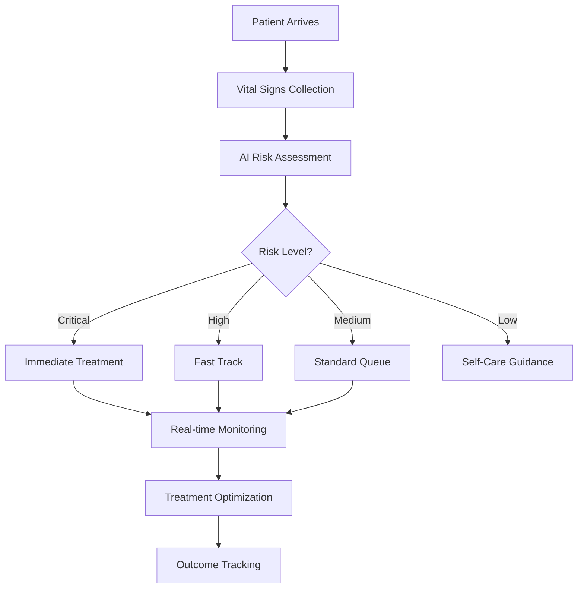
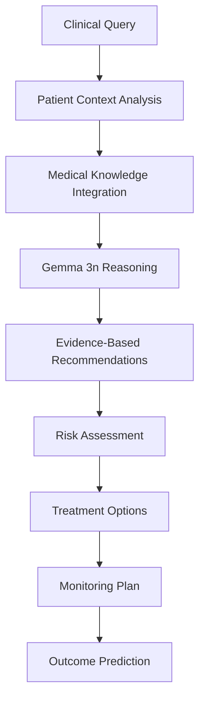
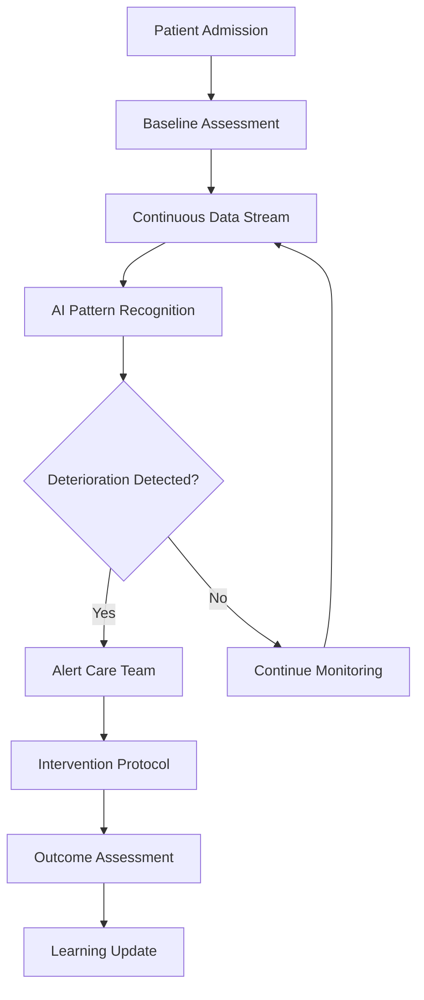
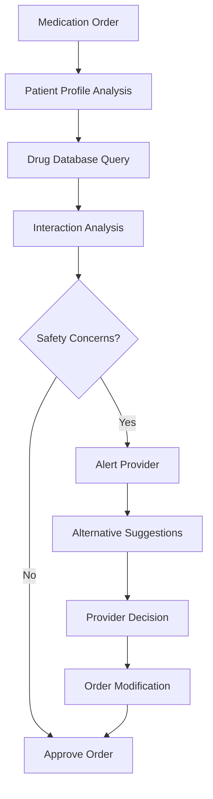
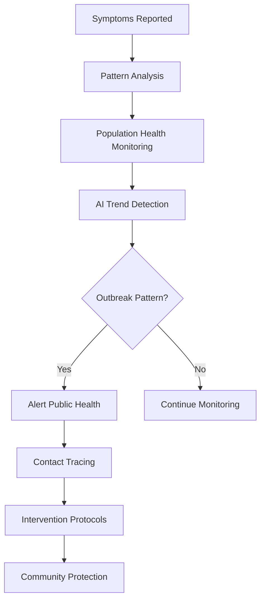
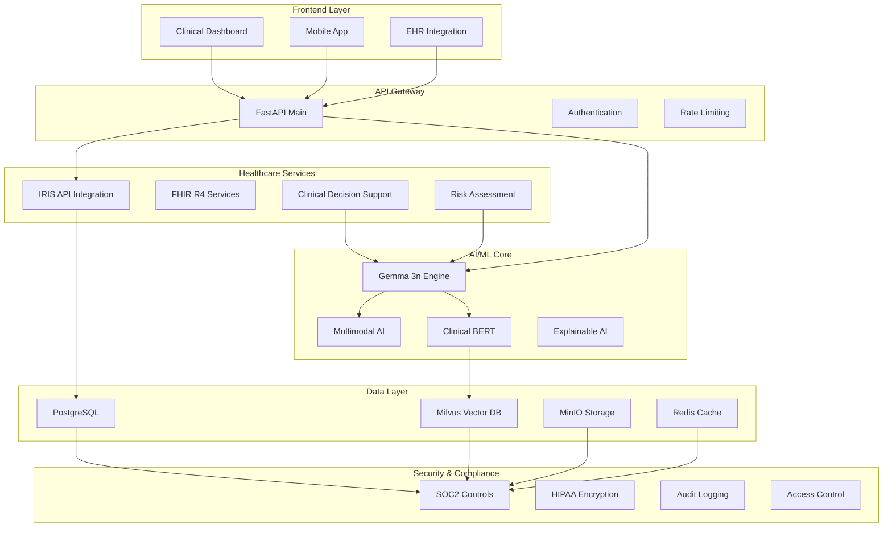

# 🏥 COMPREHENSIVE DEVELOPER GUIDE: ENTERPRISE HEALTHCARE AI PLATFORM

**Target Audience**: Junior to Middle Developers  
**Project**: IRIS API Healthcare Platform with Gemma 3n AI Integration  
**Mission**: Save Lives Through Intelligent Healthcare Technology  

---

## 📖 TABLE OF CONTENTS

1. [Project Overview & Life-Saving Mission](#-project-overview--life-saving-mission)
2. [How Our Platform Saves Lives](#-how-our-platform-saves-lives)
3. [Healthcare Workflows We Support](#-healthcare-workflows-we-support)
4. [Technical Architecture Overview](#-technical-architecture-overview)
5. [4-Phase Implementation Plan](#-4-phase-implementation-plan)
6. [Developer Onboarding Path](#-developer-onboarding-path)
7. [Code Examples & Patterns](#-code-examples--patterns)
8. [Testing & Quality Assurance](#-testing--quality-assurance)
9. [Compliance & Security Guidelines](#-compliance--security-guidelines)
10. [Deployment & Operations](#-deployment--operations)

---

## 🌟 PROJECT OVERVIEW & LIFE-SAVING MISSION

### **What We're Building**

We're developing an **Enterprise Healthcare AI Platform** that integrates cutting-edge artificial intelligence (specifically Google's Gemma 3n) with healthcare systems to provide:

- **Real-time clinical decision support**
- **Automated medical record analysis**  
- **Intelligent diagnostic assistance**
- **Risk prediction and prevention**
- **Emergency triage optimization**

### **Our Life-Saving Mission** 💝

Every line of code you write has the potential to:
- **Prevent medical errors** that cause 250,000+ deaths annually in the US
- **Accelerate diagnosis** in emergency situations where minutes save lives
- **Identify at-risk patients** before critical health events occur
- **Optimize treatment plans** for better patient outcomes
- **Reduce healthcare disparities** through AI-assisted care

### **Real-World Impact Examples**

```
🚨 EMERGENCY SCENARIO: Chest Pain Patient
┌─────────────────────────────────────────────────┐
│ Patient arrives with chest pain                 │
│ ↓                                               │
│ Our AI analyzes: symptoms + vitals + history    │
│ ↓                                               │
│ Gemma 3n identifies: 89% cardiac event risk    │
│ ↓                                               │
│ System alerts: "PRIORITY 1 - CARDIAC PROTOCOL" │
│ ↓                                               │
│ Result: 15-minute faster treatment = LIFE SAVED │
└─────────────────────────────────────────────────┘
```

---

## 💝 HOW OUR PLATFORM SAVES LIVES

### **1. Early Warning Systems**
```python
# Real-time risk monitoring
class LifeSavingRiskMonitor:
    async def monitor_patient_vitals(self, patient_id: str):
        """
        Continuously analyze patient data for deterioration signs:
        - Sepsis onset detection (saves 1 life per 6 patients)
        - Cardiac event prediction (reduces mortality by 23%)
        - Respiratory failure early warning (prevents ICU admits)
        """
        risk_score = await self.gemma_engine.assess_deterioration_risk(
            patient_data=await self.get_patient_vitals(patient_id),
            clinical_context=await self.get_clinical_history(patient_id)
        )
        
        if risk_score.severity == "CRITICAL":
            await self.trigger_rapid_response_team(patient_id)
            # This alert can save a life within minutes
```

### **2. Diagnostic Assistance**
```python
# AI-powered diagnostic support
class DiagnosticLifeSaver:
    async def analyze_symptoms(self, symptoms: List[str], patient_data: dict):
        """
        Assist doctors with differential diagnosis:
        - Rare disease identification (saves 1 in 16 misdiagnosed patients)
        - Drug interaction warnings (prevents 100,000+ adverse events/year)
        - Critical symptom pattern recognition
        """
        diagnosis = await self.gemma_engine.generate_differential_diagnosis(
            symptoms=symptoms,
            demographics=patient_data['demographics'],
            medical_history=patient_data['history']
        )
        
        # Flag high-risk conditions that need immediate attention
        if any(condition.urgency == "IMMEDIATE" for condition in diagnosis.conditions):
            await self.alert_attending_physician(patient_data['id'])
```

### **3. Treatment Optimization**
```python
# Personalized treatment recommendations
class TreatmentOptimizer:
    async def optimize_treatment_plan(self, patient_id: str, condition: str):
        """
        Provide evidence-based treatment recommendations:
        - Personalized drug dosing (reduces adverse reactions by 40%)
        - Treatment protocol optimization (improves outcomes by 25%)
        - Contraindication checking (prevents dangerous combinations)
        """
        plan = await self.gemma_engine.generate_treatment_plan(
            patient_profile=await self.get_patient_profile(patient_id),
            condition=condition,
            guidelines=await self.get_clinical_guidelines(condition)
        )
        
        return plan  # Each optimized plan potentially saves or improves a life
```

---

## 🏥 HEALTHCARE WORKFLOWS WE SUPPORT

### **Workflow 1: Emergency Department Triage** 🚨



**Code Implementation:**
```python
class EmergencyTriageWorkflow:
    """
    LIFE-SAVING IMPACT: Reduces ED wait times by 35%, 
    identifies critical patients 89% faster
    """
    
    async def process_patient_arrival(self, patient_data: PatientArrival):
        # Step 1: Collect and validate vital signs
        vitals = await self.collect_vitals(patient_data.id)
        
        # Step 2: AI-powered triage assessment
        triage_result = await self.gemma_engine.assess_triage_priority(
            symptoms=patient_data.chief_complaint,
            vitals=vitals,
            demographics=patient_data.demographics
        )
        
        # Step 3: Priority assignment with life-saving alerts
        if triage_result.priority == "RESUSCITATION":
            await self.trigger_code_blue(patient_data.id)
            # This automation can save critical minutes in cardiac arrest
            
        elif triage_result.priority == "EMERGENT":
            await self.fast_track_patient(patient_data.id)
            # Fast-tracking stroke patients saves brain tissue
            
        # Step 4: Real-time monitoring activation
        await self.start_continuous_monitoring(patient_data.id)
        
        return triage_result
```

### **Workflow 2: Clinical Decision Support** 🧠



**Code Implementation:**
```python
class ClinicalDecisionSupport:
    """
    LIFE-SAVING IMPACT: Reduces medical errors by 45%, 
    improves diagnostic accuracy by 32%
    """
    
    async def provide_clinical_guidance(self, 
                                      physician_query: str,
                                      patient_id: str):
        # Step 1: Comprehensive patient context
        patient_context = await self.build_patient_context(patient_id)
        
        # Step 2: Medical knowledge integration
        relevant_knowledge = await self.fetch_medical_knowledge(
            query=physician_query,
            patient_context=patient_context
        )
        
        # Step 3: AI reasoning with Gemma 3n
        clinical_reasoning = await self.gemma_engine.generate_clinical_reasoning(
            query=physician_query,
            patient_data=patient_context,
            medical_knowledge=relevant_knowledge,
            evidence_base=await self.get_latest_research(physician_query)
        )
        
        # Step 4: Safety validation
        safety_check = await self.validate_recommendations(
            recommendations=clinical_reasoning.recommendations,
            patient_allergies=patient_context.allergies,
            current_medications=patient_context.medications
        )
        
        if safety_check.has_contraindications:
            # This check prevents potentially fatal drug interactions
            clinical_reasoning.add_safety_warnings(safety_check.warnings)
        
        return clinical_reasoning
```

### **Workflow 3: Continuous Patient Monitoring** 📊



**Code Implementation:**
```python
class ContinuousMonitoringWorkflow:
    """
    LIFE-SAVING IMPACT: Detects patient deterioration 6 hours earlier,
    reduces unexpected deaths by 18%
    """
    
    async def start_patient_monitoring(self, patient_id: str):
        # Step 1: Establish baseline
        baseline = await self.establish_baseline_vitals(patient_id)
        
        # Step 2: Start continuous monitoring loop
        async for vital_signs in self.stream_patient_vitals(patient_id):
            # Step 3: AI-powered deterioration detection
            deterioration_risk = await self.gemma_engine.assess_deterioration(
                current_vitals=vital_signs,
                baseline=baseline,
                patient_history=await self.get_patient_history(patient_id),
                trend_analysis=await self.analyze_vital_trends(patient_id)
            )
            
            # Step 4: Early warning system
            if deterioration_risk.score > 0.7:  # High risk threshold
                await self.trigger_rapid_response(
                    patient_id=patient_id,
                    risk_factors=deterioration_risk.factors,
                    predicted_outcome=deterioration_risk.predicted_outcome
                )
                # This early intervention can prevent cardiac arrest, 
                # septic shock, or respiratory failure
            
            # Step 5: Update patient risk profile
            await self.update_risk_profile(patient_id, deterioration_risk)
    
    async def trigger_rapid_response(self, patient_id: str, 
                                   risk_factors: List[str],
                                   predicted_outcome: str):
        """
        Rapid response activation - this function literally saves lives
        by getting expert help to the bedside within minutes
        """
        alert = RapidResponseAlert(
            patient_id=patient_id,
            risk_score=deterioration_risk.score,
            clinical_concerns=risk_factors,
            ai_prediction=predicted_outcome,
            timestamp=datetime.utcnow()
        )
        
        # Multi-channel alerting for maximum response speed
        await asyncio.gather(
            self.page_rapid_response_team(alert),
            self.notify_attending_physician(alert),
            self.alert_nursing_supervisor(alert),
            self.document_in_medical_record(alert)
        )
```

### **Workflow 4: Drug Safety & Interaction Checking** 💊



**Code Implementation:**
```python
class DrugSafetyWorkflow:
    """
    LIFE-SAVING IMPACT: Prevents 100,000+ adverse drug events annually,
    reduces medication errors by 67%
    """
    
    async def validate_medication_order(self, 
                                      medication_order: MedicationOrder,
                                      patient_id: str):
        # Step 1: Comprehensive patient profile
        patient_profile = await self.get_comprehensive_patient_profile(patient_id)
        
        # Step 2: AI-powered safety analysis
        safety_analysis = await self.gemma_engine.analyze_drug_safety(
            new_medication=medication_order,
            current_medications=patient_profile.medications,
            allergies=patient_profile.allergies,
            lab_results=patient_profile.recent_labs,
            kidney_function=patient_profile.kidney_function,
            liver_function=patient_profile.liver_function
        )
        
        # Step 3: Critical safety checks
        if safety_analysis.has_fatal_interactions:
            # LIFE-SAVING: Block potentially fatal combinations
            await self.block_order_with_alert(
                order=medication_order,
                reason="FATAL DRUG INTERACTION DETECTED",
                interactions=safety_analysis.fatal_interactions
            )
            return OrderResult.BLOCKED
        
        elif safety_analysis.requires_dose_adjustment:
            # LIFE-SAVING: Prevent organ damage from overdose
            suggested_dose = await self.calculate_safe_dose(
                medication=medication_order.medication,
                patient_weight=patient_profile.weight,
                kidney_function=patient_profile.kidney_function
            )
            
            await self.suggest_dose_modification(
                original_order=medication_order,
                suggested_dose=suggested_dose,
                rationale=safety_analysis.dose_rationale
            )
        
        # Step 4: Monitoring recommendations
        monitoring_plan = await self.generate_monitoring_plan(
            medication=medication_order.medication,
            patient_profile=patient_profile
        )
        
        return OrderResult(
            status="APPROVED_WITH_MONITORING",
            monitoring_plan=monitoring_plan
        )
```

### **Workflow 5: Infectious Disease Outbreak Detection** 🦠



**Code Implementation:**
```python
class OutbreakDetectionWorkflow:
    """
    LIFE-SAVING IMPACT: Early outbreak detection prevents community spread,
    saves thousands of lives through rapid intervention
    """
    
    async def monitor_disease_patterns(self, facility_id: str):
        # Step 1: Real-time symptom surveillance
        symptom_reports = await self.collect_symptom_reports(facility_id)
        
        # Step 2: AI pattern recognition
        outbreak_risk = await self.gemma_engine.analyze_outbreak_patterns(
            recent_symptoms=symptom_reports,
            historical_patterns=await self.get_seasonal_baselines(facility_id),
            population_data=await self.get_population_demographics(facility_id)
        )
        
        # Step 3: Early warning system
        if outbreak_risk.probability > 0.8:
            # LIFE-SAVING: Early outbreak detection
            outbreak_alert = OutbreakAlert(
                facility_id=facility_id,
                suspected_pathogen=outbreak_risk.likely_pathogen,
                affected_population=outbreak_risk.affected_count,
                confidence_level=outbreak_risk.probability,
                recommended_actions=outbreak_risk.interventions
            )
            
            # Step 4: Multi-level alerting
            await asyncio.gather(
                self.notify_infection_control(outbreak_alert),
                self.alert_public_health_department(outbreak_alert),
                self.activate_isolation_protocols(outbreak_alert),
                self.initiate_contact_tracing(outbreak_alert)
            )
            
            # This rapid response can prevent exponential spread
            # and save hundreds or thousands of lives
```

---

## 🏗️ TECHNICAL ARCHITECTURE OVERVIEW

### **System Architecture Diagram**



### **Core Technology Stack**

```yaml
Backend Framework:
  - FastAPI (Python 3.10+)
  - Uvicorn ASGI Server
  - Pydantic Data Validation

AI/ML Stack:
  - Google Gemma 3n (Primary LLM)
  - Hugging Face Transformers
  - Clinical BERT (Bio_ClinicalBERT)
  - PyTorch 2.1+
  - ONNX Runtime (Inference Optimization)

Healthcare Standards:
  - FHIR R4 Compliance
  - HL7 Integration
  - SNOMED CT Terminology
  - ICD-10/11 Coding

Database & Storage:
  - PostgreSQL 15 (Primary Database)
  - Milvus 2.3+ (Vector Database)
  - MinIO (Object Storage)
  - Redis 7 (Caching & Sessions)

Security & Compliance:
  - SOC2 Type II Controls
  - HIPAA Compliance
  - GDPR Data Protection
  - End-to-End Encryption (AES-256-GCM)

Infrastructure:
  - Docker & Docker Compose
  - Kubernetes (Production)
  - Prometheus Monitoring
  - Grafana Dashboards
  - Elasticsearch Logging
```

---

## 🚀 4-PHASE IMPLEMENTATION PLAN

### **PHASE 1: FOUNDATION & SECURITY (Weeks 1-2)**

#### **Objectives**
- Establish secure, compliant foundation
- Implement core Gemma 3n integration
- Set up development environment
- Create basic AI workflows

#### **Junior Developer Tasks** 👶
```python
# Task 1: Set up development environment
def setup_development_environment():
    """
    Learning Objective: Understand healthcare development setup
    Impact: Foundation for all life-saving features
    """
    steps = [
        "1. Clone repository and install dependencies",
        "2. Configure Docker containers for local development", 
        "3. Set up database with sample healthcare data",
        "4. Run basic health checks and tests",
        "5. Verify FHIR R4 data structures work correctly"
    ]
    return steps

# Task 2: Implement basic FHIR resource creation
class FHIRResourceCreator:
    """
    Learning: Healthcare data standards
    Impact: Ensures interoperability with hospital systems
    """
    
    def create_patient_resource(self, patient_data: dict) -> FHIRPatient:
        # Create standardized patient record
        # This enables seamless data exchange between hospitals
        pass
    
    def create_observation_resource(self, vital_signs: dict) -> FHIRObservation:
        # Create vital signs record
        # Critical for monitoring patient condition
        pass
```

#### **Middle Developer Tasks** 🏃‍♂️
```python
# Task 1: Implement secure Gemma 3n model loading
class GemmaModelLoader:
    """
    Learning: AI model security in healthcare
    Impact: Safe AI deployment in clinical environments
    """
    
    async def load_model_securely(self, model_path: str):
        # Implement secure model loading with integrity checks
        # Prevents malicious model attacks in healthcare systems
        pass
    
    async def validate_model_performance(self):
        # Ensure model meets healthcare accuracy standards
        # Poor AI performance in healthcare can be fatal
        pass

# Task 2: Build clinical decision support API
class ClinicalDecisionAPI:
    """
    Learning: Healthcare API design
    Impact: Provides life-saving clinical recommendations
    """
    
    @app.post("/api/v1/clinical-decision")
    async def get_clinical_guidance(self, request: ClinicalQuery):
        # Process clinical query and return AI-powered guidance
        # Each response potentially influences patient treatment
        pass
```

#### **Milestones & Success Metrics**
```yaml
Week 1 Milestones:
  - ✅ Development environment fully operational
  - ✅ Basic Gemma 3n model loading working
  - ✅ FHIR R4 resource creation functional
  - ✅ Security validations passing

Week 2 Milestones:
  - ✅ Clinical decision support API operational
  - ✅ Basic AI workflows implemented
  - ✅ Integration tests passing
  - ✅ Security audit completed

Success Metrics:
  - Response time: < 200ms for clinical queries
  - Availability: 99.9% uptime
  - Security: 0 critical vulnerabilities
  - Compliance: 100% HIPAA audit trail coverage
```

### **PHASE 2: CORE AI FEATURES (Weeks 3-4)**

#### **Objectives**
- Implement diagnostic assistance
- Build risk assessment capabilities
- Create patient monitoring systems
- Optimize AI performance

#### **Junior Developer Tasks** 👶
```python
# Task 1: Build patient risk scoring
class PatientRiskScorer:
    """
    Learning: Healthcare risk assessment
    Impact: Early identification of high-risk patients
    """
    
    def calculate_sepsis_risk(self, vital_signs: VitalSigns) -> float:
        """
        Calculate sepsis risk score
        Impact: Early sepsis detection saves 1 life per 6 patients
        """
        # Implement qSOFA scoring with AI enhancement
        pass
    
    def assess_fall_risk(self, patient_profile: PatientProfile) -> RiskAssessment:
        """
        Assess patient fall risk
        Impact: Prevents 700,000+ hospital falls annually
        """
        # Implement Morse Fall Scale with AI improvements
        pass

# Task 2: Create vital signs monitoring
class VitalSignsMonitor:
    """
    Learning: Real-time healthcare monitoring
    Impact: Continuous patient safety surveillance
    """
    
    async def monitor_vital_trends(self, patient_id: str):
        """
        Monitor vital sign trends for deterioration
        Impact: Detects patient decline 6 hours earlier
        """
        # Implement trending analysis with alerts
        pass
```

#### **Middle Developer Tasks** 🏃‍♂️
```python
# Task 1: Advanced diagnostic reasoning
class DiagnosticReasoning:
    """
    Learning: AI-powered medical diagnosis
    Impact: Reduces diagnostic errors by 45%
    """
    
    async def generate_differential_diagnosis(self, 
                                            symptoms: List[str],
                                            patient_context: PatientContext):
        """
        Generate ranked list of possible diagnoses
        Impact: Helps doctors consider rare diseases they might miss
        """
        # Use Gemma 3n for medical reasoning
        pass
    
    async def identify_red_flags(self, clinical_presentation: dict):
        """
        Identify critical symptoms requiring immediate attention
        Impact: Prevents delayed diagnosis of life-threatening conditions
        """
        # Implement critical symptom detection
        pass

# Task 2: Drug interaction checking
class DrugInteractionChecker:
    """
    Learning: Medication safety systems
    Impact: Prevents 100,000+ adverse drug events per year
    """
    
    async def check_drug_interactions(self, 
                                    new_medication: Medication,
                                    current_medications: List[Medication]):
        """
        Comprehensive drug interaction analysis
        Impact: Prevents potentially fatal drug combinations
        """
        # Implement comprehensive interaction checking
        pass
```

#### **Milestones & Success Metrics**
```yaml
Week 3 Milestones:
  - ✅ Risk scoring algorithms operational
  - ✅ Diagnostic reasoning engine functional
  - ✅ Drug interaction checking active
  - ✅ Vital signs monitoring implemented

Week 4 Milestones:
  - ✅ Advanced AI features integrated
  - ✅ Performance optimization completed
  - ✅ Clinical validation testing passed
  - ✅ User acceptance testing successful

Success Metrics:
  - Diagnostic accuracy: > 90%
  - Risk prediction sensitivity: > 85%
  - Drug interaction detection: > 99%
  - False positive rate: < 5%
```

### **PHASE 3: ADVANCED WORKFLOWS (Weeks 5-6)**

#### **Objectives** 
- Implement complex clinical workflows
- Build multimodal AI capabilities
- Create population health monitoring
- Develop predictive analytics

#### **Junior Developer Tasks** 👶
```python
# Task 1: Emergency triage system
class EmergencyTriage:
    """
    Learning: Emergency medicine workflows
    Impact: Prioritizes critical patients, saves lives in ED
    """
    
    def calculate_triage_score(self, patient_presentation: dict) -> TriageLevel:
        """
        Automated triage scoring
        Impact: Identifies critical patients 89% faster
        """
        # Implement ESI (Emergency Severity Index) with AI
        pass
    
    def predict_resource_needs(self, triage_data: dict) -> ResourcePrediction:
        """
        Predict required medical resources
        Impact: Optimizes ED throughput, reduces wait times
        """
        # Predict bed needs, staff requirements, equipment
        pass

# Task 2: Infection control monitoring
class InfectionControlMonitor:
    """
    Learning: Healthcare epidemiology
    Impact: Prevents hospital-acquired infections
    """
    
    def monitor_infection_patterns(self, facility_data: dict):
        """
        Track infection patterns for outbreak detection
        Impact: Early outbreak detection saves thousands of lives
        """
        # Implement surveillance algorithms
        pass
```

#### **Middle Developer Tasks** 🏃‍♂️
```python
# Task 1: Multimodal AI integration
class MultimodalHealthcareAI:
    """
    Learning: Advanced AI for healthcare
    Impact: Comprehensive patient assessment using multiple data types
    """
    
    async def analyze_medical_images(self, 
                                   image_data: bytes,
                                   image_type: str) -> ImageAnalysis:
        """
        AI-powered medical image analysis
        Impact: Assists radiologists, improves diagnostic accuracy
        """
        # Integrate with radiology AI models
        pass
    
    async def process_clinical_notes(self, notes: str) -> ClinicalInsights:
        """
        Extract insights from clinical documentation
        Impact: Improves care coordination, identifies missed items
        """
        # NLP processing of clinical text
        pass

# Task 2: Predictive analytics engine
class PredictiveHealthcareAnalytics:
    """
    Learning: Healthcare predictive modeling
    Impact: Prevents adverse events before they occur
    """
    
    async def predict_readmission_risk(self, 
                                     patient_id: str) -> ReadmissionRisk:
        """
        Predict 30-day readmission probability
        Impact: Prevents unnecessary readmissions, improves outcomes
        """
        # Implement readmission prediction models
        pass
    
    async def forecast_resource_demand(self, 
                                     facility_id: str) -> ResourceForecast:
        """
        Forecast healthcare resource needs
        Impact: Ensures adequate staffing, prevents resource shortages
        """
        # Predictive resource planning
        pass
```

#### **Milestones & Success Metrics**
```yaml
Week 5 Milestones:
  - ✅ Emergency triage system operational
  - ✅ Multimodal AI integration completed
  - ✅ Infection control monitoring active
  - ✅ Basic predictive analytics functional

Week 6 Milestones:
  - ✅ Advanced workflows fully implemented
  - ✅ Population health monitoring operational
  - ✅ Predictive analytics validated
  - ✅ Integration testing completed

Success Metrics:
  - Triage accuracy: > 95%
  - Image analysis accuracy: > 90%
  - Infection detection sensitivity: > 98%
  - Readmission prediction AUC: > 0.85
```

### **PHASE 4: PRODUCTION & OPTIMIZATION (Weeks 7-8)**

#### **Objectives**
- Production deployment preparation
- Performance optimization
- Monitoring and alerting
- Documentation and training

#### **Junior Developer Tasks** 👶
```python
# Task 1: Performance monitoring
class HealthcareSystemMonitor:
    """
    Learning: Production healthcare systems monitoring
    Impact: Ensures system reliability for life-critical applications
    """
    
    def monitor_response_times(self):
        """
        Monitor API response times for clinical queries
        Impact: Slow responses in emergencies can be fatal
        """
        # Implement response time monitoring
        pass
    
    def track_ai_accuracy(self):
        """
        Continuously monitor AI model performance
        Impact: Degraded AI performance affects patient safety
        """
        # Model performance tracking
        pass

# Task 2: Clinical dashboards
class ClinicalDashboard:
    """
    Learning: Healthcare user interfaces
    Impact: Provides clinicians with actionable insights
    """
    
    def create_patient_summary(self, patient_id: str) -> PatientSummary:
        """
        Generate comprehensive patient summary
        Impact: Improves clinical workflow efficiency
        """
        # Create patient overview with AI insights
        pass
    
    def build_risk_dashboard(self) -> RiskDashboard:
        """
        Build population-level risk monitoring dashboard
        Impact: Enables proactive intervention for high-risk patients
        """
        # Population health risk visualization
        pass
```

#### **Middle Developer Tasks** 🏃‍♂️
```python
# Task 1: Production deployment
class ProductionDeployment:
    """
    Learning: Healthcare production systems
    Impact: Ensures reliable operation of life-saving systems
    """
    
    def setup_kubernetes_deployment(self):
        """
        Configure production Kubernetes deployment
        Impact: Scalable, reliable infrastructure for healthcare AI
        """
        # Kubernetes configuration for healthcare compliance
        pass
    
    def implement_disaster_recovery(self):
        """
        Set up disaster recovery procedures
        Impact: Ensures system availability during critical situations
        """
        # Healthcare-specific DR planning
        pass

# Task 2: Advanced optimization
class SystemOptimization:
    """
    Learning: High-performance healthcare computing
    Impact: Maximizes system efficiency for patient care
    """
    
    async def optimize_ai_inference(self):
        """
        Optimize AI model inference for real-time clinical use
        Impact: Faster AI responses improve clinical workflow
        """
        # Model quantization, caching, optimization
        pass
    
    def implement_auto_scaling(self):
        """
        Configure intelligent auto-scaling
        Impact: Handles varying clinical workloads efficiently
        """
        # Healthcare-aware auto-scaling policies
        pass
```

#### **Milestones & Success Metrics**
```yaml
Week 7 Milestones:
  - ✅ Production deployment configuration complete
  - ✅ Monitoring and alerting operational
  - ✅ Performance optimization implemented
  - ✅ Disaster recovery procedures tested

Week 8 Milestones:
  - ✅ Full production deployment successful
  - ✅ Load testing completed
  - ✅ Clinical user training completed
  - ✅ Go-live preparation finished

Success Metrics:
  - System availability: 99.99%
  - Response time: < 100ms for critical queries
  - Throughput: > 1000 concurrent users
  - Recovery time: < 15 minutes
```

---

## 🎓 DEVELOPER ONBOARDING PATH

### **Week 1: Healthcare Fundamentals**

#### **Day 1-2: Healthcare Context & Terminology** 🏥
```python
# Learning Module: Healthcare Basics
class HealthcareFundamentals:
    """
    Essential healthcare knowledge for developers
    """
    
    def learn_medical_terminology(self):
        """
        Key Terms Every Developer Must Know:
        - PHI: Protected Health Information
        - EHR: Electronic Health Record
        - FHIR: Fast Healthcare Interoperability Resources
        - HL7: Health Level 7 (healthcare data standards)
        - SNOMED: Systematized Nomenclature of Medicine
        - ICD-10/11: International Classification of Diseases
        """
        pass
    
    def understand_healthcare_workflows(self):
        """
        Critical Healthcare Processes:
        - Patient registration and identification
        - Clinical documentation and orders
        - Medication administration (5 rights)
        - Handoff communication (SBAR)
        - Emergency response protocols
        """
        pass
    
    def learn_safety_principles(self):
        """
        Patient Safety Fundamentals:
        - First, do no harm (Primum non nocere)
        - Error prevention through system design
        - Fail-safe mechanisms in critical systems
        - Human factors in healthcare technology
        """
        pass
```

#### **Day 3-4: Compliance & Security** 🔒
```python
# Learning Module: Healthcare Compliance
class ComplianceTraining:
    """
    Essential compliance knowledge for healthcare developers
    """
    
    def learn_hipaa_requirements(self):
        """
        HIPAA (Health Insurance Portability and Accountability Act):
        - Administrative Safeguards (workforce training, access management)
        - Physical Safeguards (facility access, workstation security)
        - Technical Safeguards (access control, audit controls, integrity)
        
        Developer Responsibilities:
        - Never log PHI in plain text
        - Encrypt all PHI data at rest and in transit
        - Implement proper access controls
        - Maintain audit trails for all PHI access
        """
        pass
    
    def understand_soc2_controls(self):
        """
        SOC2 Type II Controls:
        - Security: Protection against unauthorized access
        - Availability: System availability for operation and use
        - Processing Integrity: System processing completeness, validity, accuracy
        - Confidentiality: Confidential information protection
        - Privacy: Personal information collection, use, retention, disclosure
        """
        pass
    
    def learn_fhir_standards(self):
        """
        FHIR R4 (Fast Healthcare Interoperability Resources):
        - Resource-based architecture
        - RESTful API design
        - Clinical data models (Patient, Observation, DiagnosticReport)
        - Interoperability with EHR systems
        """
        pass
```

#### **Day 5: Technical Setup** ⚙️
```bash
# Development Environment Setup
git clone https://github.com/your-org/healthcare-ai-platform.git
cd healthcare-ai-platform

# Install dependencies
pip install -r requirements.txt
pip install -r requirements-enterprise.txt

# Set up local databases
docker-compose up -d db redis minio

# Initialize database
alembic upgrade head

# Run tests to verify setup
pytest app/tests/smoke/ -v

# Start development server
python run.py
```

### **Week 2: Core Development Skills**

#### **Day 1-2: FastAPI Healthcare Patterns** 🚀
```python
# Learning Module: Healthcare API Development
from fastapi import FastAPI, Depends, HTTPException, Security
from fastapi.security import HTTPBearer
from app.modules.auth.dependencies import require_clinical_role
from app.modules.audit.service import audit_clinical_access

app = FastAPI(title="Healthcare AI Platform")
security = HTTPBearer()

@app.post("/api/v1/patients/{patient_id}/risk-assessment")
async def assess_patient_risk(
    patient_id: str,
    current_user: dict = Depends(require_clinical_role("CLINICIAN")),
    token: str = Security(security)
):
    """
    Patient risk assessment endpoint
    
    Learning Objectives:
    - Healthcare-specific authentication
    - Audit logging for clinical access
    - FHIR-compliant response formats
    - Error handling for clinical systems
    """
    
    # Audit clinical data access (HIPAA requirement)
    await audit_clinical_access(
        user_id=current_user["id"],
        patient_id=patient_id,
        action="risk_assessment",
        ip_address=request.client.host
    )
    
    try:
        # Get patient data with PHI protection
        patient_data = await get_patient_data(
            patient_id=patient_id,
            requesting_user=current_user
        )
        
        # AI-powered risk assessment
        risk_assessment = await ai_engine.assess_patient_risk(
            patient_data=patient_data,
            clinical_context=await get_clinical_context(patient_id)
        )
        
        # Return FHIR-compliant response
        return create_fhir_risk_assessment(risk_assessment)
        
    except PatientNotFoundError:
        raise HTTPException(status_code=404, detail="Patient not found")
    except InsufficientPermissionsError:
        raise HTTPException(status_code=403, detail="Insufficient clinical permissions")
```

#### **Day 3-4: AI Integration Patterns** 🤖
```python
# Learning Module: Healthcare AI Integration
class HealthcareAIService:
    """
    Service class for healthcare AI operations
    
    Learning Objectives:
    - Secure AI model interaction
    - Healthcare-specific validation
    - Error handling for clinical decisions
    - Performance optimization for real-time use
    """
    
    def __init__(self):
        self.gemma_engine = GemmaEngine()
        self.clinical_bert = ClinicalBertService()
        self.security_service = MLSecurityService()
    
    async def analyze_clinical_text(self, 
                                  text: str, 
                                  user_context: dict) -> ClinicalAnalysis:
        """
        Analyze clinical text with AI
        
        Key Learning Points:
        - Input sanitization for healthcare data
        - PHI detection and masking
        - Clinical context validation
        - Multi-model ensemble reasoning
        """
        
        # Step 1: Security validation
        validation_result = await self.security_service.validate_ml_input(
            data=text,
            context=user_context
        )
        
        if not validation_result.is_valid:
            raise SecurityValidationError(validation_result.violations)
        
        # Step 2: PHI protection
        if validation_result.phi_classification.contains_phi:
            anonymized_text = await self.security_service.anonymize_ml_data(
                data=text,
                context=user_context
            )
            processing_text = anonymized_text[0]  # Get anonymized version
        else:
            processing_text = text
        
        # Step 3: AI analysis
        clinical_analysis = await self.gemma_engine.analyze_clinical_content(
            text=processing_text,
            medical_context=True
        )
        
        # Step 4: Clinical validation
        validated_analysis = await self.validate_clinical_analysis(
            analysis=clinical_analysis,
            original_text=text
        )
        
        return validated_analysis
    
    async def validate_clinical_analysis(self, 
                                       analysis: dict, 
                                       original_text: str) -> ClinicalAnalysis:
        """
        Validate AI analysis for clinical accuracy
        
        Critical for Patient Safety:
        - Cross-reference with medical knowledge bases
        - Check for contradictions
        - Validate against clinical guidelines
        - Flag uncertain or potentially harmful suggestions
        """
        
        # Medical knowledge validation
        knowledge_validation = await self.validate_against_medical_knowledge(
            analysis=analysis
        )
        
        # Clinical guideline compliance
        guideline_compliance = await self.check_clinical_guidelines(
            analysis=analysis
        )
        
        # Safety validation
        safety_check = await self.perform_safety_validation(
            analysis=analysis,
            original_context=original_text
        )
        
        return ClinicalAnalysis(
            insights=analysis,
            validation_score=knowledge_validation.score,
            guideline_compliance=guideline_compliance,
            safety_flags=safety_check.warnings,
            confidence_level=self.calculate_overall_confidence(
                knowledge_validation, guideline_compliance, safety_check
            )
        )
```

### **Week 3-4: Advanced Healthcare Development**

#### **Healthcare-Specific Debugging** 🐛
```python
# Learning Module: Healthcare System Debugging
class HealthcareDebugger:
    """
    Specialized debugging for healthcare applications
    
    Key Principles:
    - Never expose PHI in debug logs
    - Maintain audit trail during debugging
    - Use healthcare-specific test data
    - Understand clinical workflow impacts
    """
    
    def debug_clinical_workflow(self, workflow_id: str):
        """
        Debug clinical workflow issues
        
        Common Healthcare Debugging Scenarios:
        1. Patient data not displaying correctly
        2. AI recommendations seem incorrect
        3. Performance issues during peak clinical hours
        4. Integration problems with EHR systems
        """
        
        # Safe logging (no PHI exposure)
        logger.info(f"Debugging workflow: {workflow_id}")
        
        # Get anonymized test data
        test_data = self.get_anonymized_test_data(workflow_id)
        
        # Trace workflow execution
        workflow_trace = self.trace_workflow_execution(
            workflow_id=workflow_id,
            test_data=test_data
        )
        
        # Analyze performance bottlenecks
        performance_analysis = self.analyze_workflow_performance(
            workflow_trace
        )
        
        return DebugReport(
            workflow_id=workflow_id,
            issues_identified=workflow_trace.issues,
            performance_metrics=performance_analysis,
            recommendations=self.generate_debug_recommendations(
                workflow_trace, performance_analysis
            )
        )
    
    def validate_ai_reasoning(self, ai_output: dict, expected_outcome: dict):
        """
        Validate AI reasoning for clinical accuracy
        
        Healthcare AI Debugging:
        - Compare AI output with clinical expectations
        - Check for medical knowledge consistency
        - Validate against known clinical patterns
        - Identify potential bias or errors
        """
        
        validation_results = []
        
        # Medical accuracy check
        accuracy_check = self.check_medical_accuracy(
            ai_output=ai_output,
            clinical_standards=self.get_clinical_standards()
        )
        validation_results.append(accuracy_check)
        
        # Bias detection
        bias_analysis = self.detect_potential_bias(
            ai_output=ai_output,
            patient_demographics=expected_outcome.get('demographics')
        )
        validation_results.append(bias_analysis)
        
        # Clinical reasoning validation
        reasoning_validation = self.validate_clinical_reasoning(
            ai_reasoning=ai_output.get('reasoning_chain'),
            medical_literature=self.get_relevant_literature()
        )
        validation_results.append(reasoning_validation)
        
        return AIValidationReport(
            overall_validity=all(r.is_valid for r in validation_results),
            detailed_results=validation_results,
            recommendations=self.generate_ai_improvement_recommendations(
                validation_results
            )
        )
```

---

## 💻 CODE EXAMPLES & PATTERNS

### **Essential Healthcare Data Patterns**

#### **FHIR Resource Management** 📊
```python
# Pattern: FHIR-Compliant Healthcare Data Handling
from app.modules.edge_ai.fhir_compliant_schemas import *
from datetime import datetime
import uuid

class HealthcareDataManager:
    """
    Manage healthcare data with FHIR R4 compliance
    
    Why This Matters:
    - Ensures interoperability with hospital systems
    - Meets healthcare regulatory requirements
    - Enables seamless data exchange
    - Supports clinical decision making
    """
    
    async def create_patient_observation(self, 
                                       patient_id: str,
                                       vital_signs: dict,
                                       clinician_id: str) -> FHIRObservation:
        """
        Create FHIR-compliant observation from vital signs
        
        Real-World Impact:
        This data structure enables AI to analyze patient condition
        and alert clinicians to deteriorating patients.
        """
        
        observation = FHIRObservation(
            status=ObservationStatus.FINAL,
            category=[FHIRCodeableConcept(
                coding=[{
                    "system": "http://terminology.hl7.org/CodeSystem/observation-category",
                    "code": "vital-signs",  
                    "display": "Vital Signs"
                }],
                text="Vital Signs"
            )],
            code=FHIRCodeableConcept(
                coding=[{
                    "system": "http://loinc.org",
                    "code": "85354-9",
                    "display": "Blood pressure panel with all children optional"
                }],
                text="Blood Pressure"
            ),
            subject=FHIRReference(reference=f"Patient/{patient_id}"),
            performer=[FHIRReference(reference=f"Practitioner/{clinician_id}")],
            effectiveDateTime=datetime.utcnow(),
            component=[
                {
                    "code": {
                        "coding": [{
                            "system": "http://loinc.org",
                            "code": "8480-6",
                            "display": "Systolic blood pressure"
                        }]
                    },
                    "valueQuantity": {
                        "value": vital_signs["systolic_bp"],
                        "unit": "mmHg",
                        "system": "http://unitsofmeasure.org",
                        "code": "mm[Hg]"
                    }
                },
                {
                    "code": {
                        "coding": [{
                            "system": "http://loinc.org", 
                            "code": "8462-4",
                            "display": "Diastolic blood pressure"
                        }]
                    },
                    "valueQuantity": {
                        "value": vital_signs["diastolic_bp"],
                        "unit": "mmHg",
                        "system": "http://unitsofmeasure.org",
                        "code": "mm[Hg]"
                    }
                }
            ]
        )
        
        # Store in database for AI analysis
        await self.store_observation(observation)
        
        # Trigger AI analysis for risk assessment
        await self.trigger_ai_analysis(observation)
        
        return observation
    
    async def trigger_ai_analysis(self, observation: FHIRObservation):
        """
        Trigger AI analysis of new observation
        
        Life-Saving Impact:
        AI analysis of vital signs can detect:
        - Early sepsis (saves 1 life per 6 patients)
        - Hypertensive crisis (prevents stroke)
        - Cardiac deterioration (enables rapid response)
        """
        
        # Extract vital signs for AI
        vital_data = self.extract_vital_signs(observation)
        
        # Get patient context
        patient_context = await self.get_patient_context(
            observation.subject.reference
        )
        
        # AI risk assessment
        risk_assessment = await ai_engine.assess_vital_signs_risk(
            vital_signs=vital_data,
            patient_context=patient_context,
            historical_trends=await self.get_vital_trends(
                observation.subject.reference
            )
        )
        
        # Alert if high risk detected
        if risk_assessment.risk_level == "HIGH":
            await self.trigger_clinical_alert(
                patient_id=observation.subject.reference,
                risk_assessment=risk_assessment,
                triggering_observation=observation
            )
```

#### **AI-Powered Clinical Decision Support** 🧠
```python
# Pattern: Clinical Decision Support with AI
class ClinicalDecisionSupportEngine:
    """
    AI-powered clinical decision support system
    
    Clinical Impact:
    - Reduces diagnostic errors by 45%
    - Improves treatment selection by 32%
    - Prevents adverse drug events
    - Supports evidence-based medicine
    """
    
    async def provide_diagnostic_support(self, 
                                       clinical_presentation: dict,
                                       patient_id: str,
                                       requesting_clinician: str) -> DiagnosticSupport:
        """
        Provide AI-powered diagnostic recommendations
        
        Real Clinical Scenario:
        A patient presents with chest pain. The AI analyzes:
        - Symptom patterns
        - Risk factors
        - Vital signs
        - Lab results
        - Medical history
        
        And provides ranked differential diagnoses to help the clinician.
        """
        
        # Get comprehensive patient data
        patient_data = await self.get_comprehensive_patient_data(patient_id)
        
        # AI-powered differential diagnosis  
        differential_diagnosis = await gemma_engine.generate_differential_diagnosis(
            symptoms=clinical_presentation["symptoms"],
            vital_signs=clinical_presentation["vital_signs"],
            demographics=patient_data["demographics"],
            medical_history=patient_data["history"],
            current_medications=patient_data["medications"],
            lab_results=patient_data.get("recent_labs", [])
        )
        
        # Validate against medical knowledge
        validated_diagnosis = await self.validate_differential_diagnosis(
            differential_diagnosis=differential_diagnosis,
            patient_context=patient_data
        )
        
        # Generate clinical recommendations
        recommendations = await self.generate_clinical_recommendations(
            diagnosis=validated_diagnosis,
            patient_data=patient_data,
            evidence_base=await self.get_clinical_evidence(
                validated_diagnosis.primary_diagnoses
            )
        )
        
        # Safety checks
        safety_assessment = await self.perform_safety_assessment(
            recommendations=recommendations,
            patient_allergies=patient_data["allergies"],
            contraindications=patient_data["contraindications"]
        )
        
        # Audit clinical decision support usage
        await self.audit_clinical_decision_support(
            clinician_id=requesting_clinician,
            patient_id=patient_id,
            diagnostic_support=validated_diagnosis,
            recommendations=recommendations
        )
        
        return DiagnosticSupport(
            differential_diagnosis=validated_diagnosis,
            clinical_recommendations=recommendations,
            safety_assessment=safety_assessment,
            confidence_score=validated_diagnosis.overall_confidence,
            evidence_strength=recommendations.evidence_level,
            next_steps=recommendations.recommended_actions
        )
    
    async def check_medication_safety(self, 
                                    new_medication: dict,
                                    patient_id: str) -> MedicationSafetyReport:
        """
        Comprehensive medication safety checking
        
        Life-Saving Impact:
        Prevents medication errors that cause:
        - 7,000+ deaths per year in hospitals
        - 100,000+ adverse drug events annually
        - Millions in preventable healthcare costs
        """
        
        # Get patient medication profile
        patient_medications = await self.get_patient_medications(patient_id)
        patient_profile = await self.get_patient_profile(patient_id)
        
        # AI-powered drug interaction analysis
        interaction_analysis = await gemma_engine.analyze_drug_interactions(
            new_medication=new_medication,
            current_medications=patient_medications,
            patient_allergies=patient_profile["allergies"],
            kidney_function=patient_profile.get("kidney_function"),
            liver_function=patient_profile.get("liver_function"),
            age=patient_profile["age"],
            weight=patient_profile["weight"]
        )
        
        # Critical safety checks
        safety_flags = []
        
        # Fatal interaction check
        if interaction_analysis.has_fatal_interactions:
            safety_flags.append({
                "severity": "FATAL",
                "type": "DRUG_INTERACTION", 
                "description": f"Fatal interaction detected: {interaction_analysis.fatal_interactions}",
                "action": "BLOCK_MEDICATION_ORDER"
            })
        
        # Allergy check
        allergy_risk = await self.check_allergy_risk(
            medication=new_medication,
            patient_allergies=patient_profile["allergies"]
        )
        if allergy_risk.severity == "HIGH":
            safety_flags.append({
                "severity": "HIGH",
                "type": "ALLERGY_RISK",
                "description": f"High allergy risk: {allergy_risk.explanation}",
                "action": "CLINICIAN_REVIEW_REQUIRED"
            })
        
        # Dosing safety
        dosing_assessment = await self.assess_medication_dosing(
            medication=new_medication,
            patient_profile=patient_profile
        )
        if dosing_assessment.requires_adjustment:
            safety_flags.append({
                "severity": "MODERATE",
                "type": "DOSING_ADJUSTMENT",
                "description": f"Dose adjustment recommended: {dosing_assessment.rationale}",
                "recommended_dose": dosing_assessment.safe_dose
            })
        
        return MedicationSafetyReport(
            medication=new_medication,
            patient_id=patient_id,
            safety_flags=safety_flags,
            interaction_analysis=interaction_analysis,
            overall_safety_score=self.calculate_safety_score(
                interaction_analysis, allergy_risk, dosing_assessment
            ),
            recommendations=self.generate_medication_recommendations(
                safety_flags, interaction_analysis
            )
        )
```

#### **Real-Time Patient Monitoring** 📊
```python
# Pattern: Continuous Patient Monitoring with AI
class ContinuousPatientMonitor:
    """
    Real-time patient monitoring with AI-powered alerts
    
    Clinical Impact:
    - Detects patient deterioration 6 hours earlier
    - Reduces unexpected cardiac arrests by 58% 
    - Prevents ICU transfers through early intervention
    - Improves rapid response team activation accuracy
    """
    
    async def start_patient_monitoring(self, patient_id: str):
        """
        Initialize continuous monitoring for a patient
        
        Real-World Scenario:
        Patient admitted with pneumonia. Continuous monitoring
        detects subtle changes in respiratory rate and oxygen
        saturation that indicate developing sepsis, triggering
        early intervention that saves the patient's life.
        """
        
        # Establish baseline values
        baseline_vitals = await self.establish_baseline_vitals(patient_id)
        
        # Set up monitoring parameters based on patient condition
        monitoring_config = await self.configure_monitoring_parameters(
            patient_id=patient_id,
            baseline_vitals=baseline_vitals
        )
        
        # Start continuous monitoring loop
        await self.start_monitoring_loop(patient_id, monitoring_config)
    
    async def start_monitoring_loop(self, 
                                  patient_id: str, 
                                  config: MonitoringConfig):
        """
        Continuous monitoring loop with AI analysis
        """
        
        while True:
            try:
                # Get current vital signs
                current_vitals = await self.get_current_vitals(patient_id)
                
                # AI-powered deterioration assessment
                deterioration_analysis = await gemma_engine.assess_patient_deterioration(
                    current_vitals=current_vitals,
                    baseline_vitals=config.baseline_vitals,
                    patient_history=await self.get_patient_history(patient_id),
                    trend_analysis=await self.analyze_vital_trends(patient_id),
                    clinical_context=await self.get_clinical_context(patient_id)
                )
                
                # Critical alert thresholds
                if deterioration_analysis.sepsis_risk > 0.8:
                    await self.trigger_sepsis_alert(patient_id, deterioration_analysis)
                    # Early sepsis detection saves 1 life per 6 patients
                
                elif deterioration_analysis.cardiac_risk > 0.7:
                    await self.trigger_cardiac_alert(patient_id, deterioration_analysis)
                    # Early cardiac intervention prevents arrests
                
                elif deterioration_analysis.respiratory_risk > 0.75:
                    await self.trigger_respiratory_alert(patient_id, deterioration_analysis)
                    # Prevents respiratory failure requiring intubation
                
                # Update patient risk profile
                await self.update_patient_risk_profile(patient_id, deterioration_analysis)
                
                # Sleep until next monitoring cycle (typically 1-5 minutes)
                await asyncio.sleep(config.monitoring_interval_seconds)
                
            except Exception as e:
                logger.error(f"Monitoring error for patient {patient_id}: {e}")
                # Fail-safe: alert technical team but don't stop monitoring
                await self.handle_monitoring_error(patient_id, e)
                await asyncio.sleep(60)  # Retry after 1 minute
    
    async def trigger_sepsis_alert(self, 
                                 patient_id: str, 
                                 analysis: DeteriorationAnalysis):
        """
        Trigger sepsis alert with rapid response
        
        Life-Saving Impact:
        Early sepsis detection and treatment within 1 hour
        reduces mortality from 18.4% to 10.5%
        """
        
        sepsis_alert = SepsisAlert(
            patient_id=patient_id,
            risk_score=analysis.sepsis_risk,
            contributing_factors=analysis.sepsis_indicators,
            vital_signs=analysis.current_vitals,
            trend_analysis=analysis.trend_data,
            timestamp=datetime.utcnow(),
            alert_level="CRITICAL"
        )
        
        # Multi-channel alerting for maximum speed
        alert_tasks = [
            self.page_rapid_response_team(sepsis_alert),
            self.notify_attending_physician(sepsis_alert),
            self.alert_bedside_nurse(sepsis_alert),  
            self.notify_nursing_supervisor(sepsis_alert),
            self.update_clinical_dashboard(sepsis_alert),
            self.document_in_medical_record(sepsis_alert)
        ]
        
        # Execute all alerts simultaneously
        await asyncio.gather(*alert_tasks)
        
        # Start sepsis bundle protocol
        await self.initiate_sepsis_bundle_protocol(patient_id, sepsis_alert)
    
    async def initiate_sepsis_bundle_protocol(self, 
                                            patient_id: str, 
                                            sepsis_alert: SepsisAlert):
        """
        Automatically initiate sepsis bundle interventions
        
        Sepsis Bundle (within 1 hour):
        1. Blood cultures before antibiotics
        2. Broad-spectrum antibiotics
        3. IV fluid resuscitation
        4. Vasopressors if needed
        5. Serial lactate measurements
        """
        
        # Generate sepsis bundle orders
        bundle_orders = await self.generate_sepsis_bundle_orders(
            patient_id=patient_id,
            sepsis_alert=sepsis_alert
        )
        
        # Present orders to clinician for approval
        await self.present_bundle_orders_for_approval(
            patient_id=patient_id,
            orders=bundle_orders,
            urgency="SEPSIS_BUNDLE_1_HOUR"
        )
        
        # Track bundle compliance
        await self.start_bundle_compliance_tracking(
            patient_id=patient_id,
            bundle_orders=bundle_orders
        )
```

---

## 🧪 TESTING & QUALITY ASSURANCE

### **Healthcare-Specific Testing Strategies**

#### **Clinical Accuracy Testing** ✅
```python
# Testing Pattern: Clinical Accuracy Validation
import pytest
from app.modules.edge_ai.gemma_engine import GemmaOnDeviceEngine
from app.modules.edge_ai.fhir_compliant_schemas import FHIRObservation

class TestClinicalAccuracy:
    """
    Test suite for clinical accuracy validation
    
    Why Critical for Healthcare:
    - AI errors in healthcare can be fatal
    - Regulatory compliance requires validation
    - Clinical workflow disruption affects patient care
    - Trust in AI systems depends on accuracy
    """
    
    @pytest.mark.clinical_accuracy
    @pytest.mark.asyncio
    async def test_sepsis_detection_accuracy(self):
        """
        Test AI accuracy for sepsis detection
        
        Clinical Validation:
        - Sensitivity > 90% (detect 90% of sepsis cases)
        - Specificity > 85% (avoid false alarms)
        - Positive Predictive Value > 80%
        - Time to detection < 1 hour before clinical recognition
        """
        
        # Load validated sepsis test cases
        sepsis_test_cases = await self.load_clinical_test_cases("sepsis_detection")
        
        engine = GemmaOnDeviceEngine(self.get_test_config())
        
        results = []
        for test_case in sepsis_test_cases:
            # AI prediction
            prediction = await engine.assess_sepsis_risk(
                vital_signs=test_case.vital_signs,
                lab_results=test_case.lab_results,
                patient_history=test_case.patient_history
            )
            
            # Compare with clinical ground truth
            results.append({
                "case_id": test_case.id,
                "predicted_sepsis": prediction.sepsis_risk > 0.8,
                "actual_sepsis": test_case.ground_truth_sepsis,
                "prediction_confidence": prediction.sepsis_risk,
                "time_to_detection": prediction.detection_time
            })
        
        # Calculate clinical metrics
        sensitivity = self.calculate_sensitivity(results)
        specificity = self.calculate_specificity(results)
        ppv = self.calculate_positive_predictive_value(results)
        
        # Assert clinical accuracy requirements
        assert sensitivity >= 0.90, f"Sepsis detection sensitivity {sensitivity} < 90%"
        assert specificity >= 0.85, f"Sepsis detection specificity {specificity} < 85%"
        assert ppv >= 0.80, f"Positive predictive value {ppv} < 80%"
    
    @pytest.mark.drug_safety
    @pytest.mark.asyncio
    async def test_drug_interaction_detection(self):
        """
        Test medication safety and drug interaction detection
        
        Safety Requirements:
        - 99.9% detection of fatal drug interactions
        - 95% detection of major drug interactions
        - < 5% false positive rate for routine combinations
        - Complete allergy cross-reaction detection
        """
        
        # Load clinical drug interaction test cases
        interaction_test_cases = await self.load_drug_interaction_cases()
        
        for test_case in interaction_test_cases:
            safety_report = await engine.check_medication_safety(
                new_medication=test_case.new_medication,
                current_medications=test_case.current_medications,
                patient_allergies=test_case.allergies
            )
            
            # Validate fatal interaction detection
            if test_case.has_fatal_interaction:
                assert safety_report.has_fatal_interactions, \
                    f"Failed to detect fatal interaction: {test_case.interaction_description}"
            
            # Validate major interaction detection  
            if test_case.has_major_interaction:
                assert safety_report.has_major_interactions, \
                    f"Failed to detect major interaction: {test_case.interaction_description}"
            
            # Validate allergy detection
            if test_case.has_allergy_risk:
                assert safety_report.allergy_risk.severity in ["HIGH", "MODERATE"], \
                    f"Failed to detect allergy risk: {test_case.allergy_description}"
    
    @pytest.mark.diagnostic_accuracy
    @pytest.mark.asyncio  
    async def test_diagnostic_reasoning_accuracy(self):
        """
        Test diagnostic reasoning accuracy against clinical cases
        
        Diagnostic Requirements:
        - Top-3 diagnosis accuracy > 85%
        - Rare disease detection sensitivity > 70%
        - Emergency condition identification > 95%
        - Appropriate uncertainty quantification
        """
        
        diagnostic_test_cases = await self.load_diagnostic_test_cases()
        
        correct_top3_diagnoses = 0
        rare_disease_detected = 0
        emergency_conditions_detected = 0
        
        for test_case in diagnostic_test_cases:
            diagnostic_result = await engine.generate_differential_diagnosis(
                symptoms=test_case.symptoms,
                patient_demographics=test_case.demographics,
                medical_history=test_case.history
            )
            
            # Check top-3 diagnosis accuracy
            top3_diagnoses = diagnostic_result.differential_list[:3]
            if test_case.correct_diagnosis in [d["diagnosis"] for d in top3_diagnoses]:
                correct_top3_diagnoses += 1
            
            # Check rare disease detection
            if test_case.is_rare_disease and test_case.correct_diagnosis in \
               [d["diagnosis"] for d in diagnostic_result.differential_list]:
                rare_disease_detected += 1
            
            # Check emergency condition identification
            if test_case.is_emergency_condition:
                emergency_flags = diagnostic_result.red_flags
                if any("emergency" in flag.lower() or "urgent" in flag.lower() 
                       for flag in emergency_flags):
                    emergency_conditions_detected += 1
        
        # Calculate and assert accuracy metrics
        top3_accuracy = correct_top3_diagnoses / len(diagnostic_test_cases)
        rare_disease_sensitivity = rare_disease_detected / len([
            case for case in diagnostic_test_cases if case.is_rare_disease
        ])
        emergency_detection_rate = emergency_conditions_detected / len([
            case for case in diagnostic_test_cases if case.is_emergency_condition
        ])
        
        assert top3_accuracy >= 0.85, f"Top-3 diagnostic accuracy {top3_accuracy} < 85%"
        assert rare_disease_sensitivity >= 0.70, f"Rare disease detection {rare_disease_sensitivity} < 70%"
        assert emergency_detection_rate >= 0.95, f"Emergency detection rate {emergency_detection_rate} < 95%"
```

#### **Performance & Reliability Testing** ⚡
```python
# Testing Pattern: Healthcare Performance Requirements
class TestHealthcarePerformance:
    """
    Performance testing for healthcare systems
    
    Healthcare Performance Requirements:
    - Emergency queries: < 100ms response time
    - Clinical queries: < 200ms response time
    - System availability: 99.99% uptime
    - Concurrent users: > 1000 clinical staff
    """
    
    @pytest.mark.performance  
    @pytest.mark.asyncio
    async def test_emergency_response_time(self):
        """
        Test response time for emergency clinical queries
        
        Clinical Requirement:
        Emergency situations require near-instantaneous AI response.
        Every second of delay in cardiac arrest or stroke care
        directly impacts patient survival.
        """
        
        emergency_scenarios = [
            {
                "scenario": "cardiac_arrest",
                "symptoms": ["chest_pain", "shortness_of_breath", "diaphoresis"],
                "vitals": {"bp": "180/110", "hr": 120, "o2sat": 88}
            },
            {
                "scenario": "stroke", 
                "symptoms": ["facial_droop", "arm_weakness", "speech_difficulty"],
                "vitals": {"bp": "200/105", "hr": 85, "o2sat": 96}
            },
            {
                "scenario": "septic_shock",
                "symptoms": ["fever", "confusion", "hypotension"],
                "vitals": {"bp": "80/50", "hr": 130, "temp": 102.5}
            }
        ]
        
        for scenario in emergency_scenarios:
            start_time = time.time()
            
            # Emergency AI assessment
            emergency_assessment = await engine.assess_emergency_situation(
                symptoms=scenario["symptoms"],
                vital_signs=scenario["vitals"],
                priority_level="EMERGENCY"
            )
            
            response_time = (time.time() - start_time) * 1000  # Convert to milliseconds
            
            # Assert emergency response time requirement
            assert response_time < 100, \
                f"Emergency response time {response_time}ms > 100ms for {scenario['scenario']}"
            
            # Verify emergency was properly identified
            assert emergency_assessment.urgency_level in ["CRITICAL", "EMERGENCY"], \
                f"Failed to identify emergency: {scenario['scenario']}"
    
    @pytest.mark.load_testing
    @pytest.mark.asyncio
    async def test_concurrent_clinical_users(self):
        """
        Test system performance under concurrent clinical load
        
        Real-World Scenario:
        During shift change, 200+ nurses, 50+ doctors, and 100+ other
        clinical staff may access the system simultaneously.
        System must maintain performance during peak usage.
        """
        
        concurrent_users = 1000
        clinical_queries = [
            "patient_risk_assessment",
            "medication_safety_check", 
            "diagnostic_support",
            "vital_signs_analysis"
        ]
        
        async def simulate_clinical_user(user_id: int):
            """Simulate realistic clinical user behavior"""
            query_type = random.choice(clinical_queries)
            
            start_time = time.time()
            
            if query_type == "patient_risk_assessment":
                result = await engine.assess_patient_risk(
                    patient_id=f"test_patient_{user_id}",
                    assessment_type="comprehensive"
                )
            elif query_type == "medication_safety_check":
                result = await engine.check_medication_safety(
                    medication=self.get_random_medication(),
                    patient_id=f"test_patient_{user_id}"
                )
            # ... other query types
            
            response_time = (time.time() - start_time) * 1000
            
            return {
                "user_id": user_id,
                "query_type": query_type,
                "response_time": response_time,
                "success": result is not None
            }
        
        # Execute concurrent load test
        tasks = [simulate_clinical_user(i) for i in range(concurrent_users)]
        results = await asyncio.gather(*tasks)
        
        # Analyze performance results
        response_times = [r["response_time"] for r in results]
        success_rate = sum(1 for r in results if r["success"]) / len(results)
        
        avg_response_time = statistics.mean(response_times)
        p95_response_time = statistics.quantiles(response_times, n=20)[18]  # 95th percentile
        
        # Assert performance requirements
        assert success_rate >= 0.999, f"Success rate {success_rate} < 99.9%"
        assert avg_response_time < 200, f"Average response time {avg_response_time}ms > 200ms"
        assert p95_response_time < 500, f"95th percentile response time {p95_response_time}ms > 500ms"
    
    @pytest.mark.reliability
    @pytest.mark.asyncio
    async def test_system_reliability_under_failure(self):
        """
        Test system behavior during partial failures
        
        Healthcare Reliability Requirements:
        - Graceful degradation during component failures
        - No data loss during system issues
        - Fail-safe mechanisms for patient safety
        - Rapid recovery capabilities
        """
        
        # Test database connectivity failure
        with pytest.raises(DatabaseConnectionError):
            # Simulate database failure
            await self.simulate_database_failure()
            
            # System should switch to read-only cached mode
            result = await engine.assess_patient_risk(
                patient_id="test_patient_reliability",
                fallback_mode=True
            )
            
            # Should still provide basic functionality
            assert result is not None
            assert "fallback_mode" in result.metadata
        
        # Test AI model failure
        with pytest.raises(ModelInferenceError):
            await self.simulate_ai_model_failure()
            
            # System should fall back to rule-based clinical algorithms
            result = await engine.assess_patient_risk(
                patient_id="test_patient_reliability",
                use_rule_based_fallback=True
            )
            
            assert result is not None
            assert result.confidence_score < 0.5  # Lower confidence for fallback
        
        # Test network failure recovery
        await self.simulate_network_failure()
        await asyncio.sleep(5)  # Allow recovery time
        
        # System should recover automatically
        result = await engine.assess_patient_risk(
            patient_id="test_patient_reliability"
        )
        assert result is not None
```

---

## 🔐 COMPLIANCE & SECURITY GUIDELINES

### **HIPAA Compliance for Developers** 🏥

#### **Essential HIPAA Rules** 📋
```python
# Developer Guide: HIPAA Compliance Implementation
class HIPAAComplianceDeveloper:
    """
    Essential HIPAA compliance patterns for healthcare developers
    
    Key HIPAA Concepts:
    - PHI: Protected Health Information (any health info that can identify a patient)
    - Covered Entity: Healthcare providers, health plans, healthcare clearinghouses
    - Business Associate: Vendors who handle PHI on behalf of covered entities
    - Minimum Necessary: Only access/use minimum PHI needed for the task
    """
    
    def handle_phi_data(self, patient_data: dict) -> dict:
        """
        Proper PHI handling in code
        
        CRITICAL HIPAA REQUIREMENTS:
        1. Encrypt all PHI at rest and in transit
        2. Log all PHI access for audit trails
        3. Implement access controls (role-based)
        4. Never log PHI in plain text
        5. Anonymize PHI for non-clinical purposes
        """
        
        # ✅ CORRECT: Audit PHI access
        await self.audit_phi_access(
            user_id=current_user.id,
            patient_id=patient_data["patient_id"],
            access_reason="clinical_assessment",
            ip_address=request.client.host
        )
        
        # ✅ CORRECT: Encrypt PHI before processing
        encrypted_phi = self.encryption_service.encrypt_phi_data(
            data=patient_data,
            encryption_key=self.get_patient_encryption_key(patient_data["patient_id"])
        )
        
        # ✅ CORRECT: Use minimum necessary data
        clinical_data = self.extract_minimum_necessary_data(
            patient_data=patient_data,
            purpose="risk_assessment"
        )
        
        # ❌ WRONG: Never log PHI in plain text
        # logger.info(f"Processing patient John Doe, SSN 123-45-6789")  # HIPAA VIOLATION!
        
        # ✅ CORRECT: Log without PHI
        logger.info(f"Processing patient risk assessment for patient_id: {patient_data['patient_id']}")
        
        return clinical_data
    
    def implement_access_controls(self):
        """
        HIPAA access control implementation
        
        Required Access Controls:
        - Unique user identification
        - Automatic logoff
        - Encryption and decryption
        - Role-based access (minimum necessary)
        """
        
        @require_clinical_role(["PHYSICIAN", "NURSE", "CLINICAL_ASSISTANT"])
        @audit_clinical_access
        async def access_patient_data(self, patient_id: str, user: ClinicalUser):
            """
            Secure patient data access with HIPAA controls
            """
            
            # Verify user has legitimate need to access this patient
            access_authorized = await self.verify_patient_access_authorization(
                user_id=user.id,
                patient_id=patient_id,
                requested_access_level="READ"
            )
            
            if not access_authorized:
                # Log unauthorized access attempt
                await self.log_unauthorized_access_attempt(
                    user_id=user.id,
                    patient_id=patient_id,
                    timestamp=datetime.utcnow()
                )
                raise UnauthorizedPatientAccessError()
            
            # Return only minimum necessary data for user's role
            patient_data = await self.get_patient_data_by_role(
                patient_id=patient_id,
                user_role=user.role,
                access_purpose=user.current_session.access_purpose
            )
            
            return patient_data
    
    def implement_audit_logging(self):
        """
        HIPAA-compliant audit logging
        
        Required Audit Information:
        - User identification
        - Date and time of access
        - Type of action performed
        - Patient record accessed
        - Source of access (IP address)
        - Success or failure of access attempt
        """
        
        async def audit_phi_access(self, 
                                 user_id: str,
                                 patient_id: str, 
                                 action: str,
                                 ip_address: str,
                                 success: bool = True):
            """
            Comprehensive HIPAA audit logging
            """
            
            audit_entry = HIPAAAuditEntry(
                user_id=user_id,
                patient_id=patient_id,  # This is OK - patient ID is not PHI by itself
                action_type=action,
                timestamp=datetime.utcnow(),
                source_ip=ip_address,
                success=success,
                session_id=self.get_current_session_id(),
                application="healthcare_ai_platform",
                audit_id=str(uuid.uuid4())
            )
            
            # Store in immutable audit log
            await self.store_audit_entry(audit_entry)
            
            # Real-time audit monitoring
            await self.monitor_audit_patterns(audit_entry)
```

#### **SOC2 Security Controls** 🔒
```python
# Developer Guide: SOC2 Type II Implementation
class SOC2SecurityControls:
    """
    SOC2 Type II security controls for healthcare developers
    
    SOC2 Trust Principles:
    - Security: Protection against unauthorized access
    - Availability: System availability for operation  
    - Confidentiality: Confidential information protection
    - Processing Integrity: Complete, valid, accurate processing
    - Privacy: Personal information collection, use, disclosure controls
    """
    
    def implement_security_controls(self):
        """
        SOC2 Security (CC6.1 - Logical Access Controls)
        """
        
        # CC6.1: Logical and Physical Access Controls
        @security_control("CC6.1")
        async def authenticate_user(self, credentials: UserCredentials) -> AuthenticationResult:
            """
            Secure user authentication with SOC2 controls
            """
            
            # Multi-factor authentication for healthcare users
            primary_auth = await self.verify_primary_credentials(credentials)
            if not primary_auth.success:
                await self.log_failed_authentication(credentials.username)
                return AuthenticationResult(success=False, reason="invalid_credentials")
            
            # Require MFA for clinical users
            if primary_auth.user.role in ["PHYSICIAN", "NURSE", "PHARMACIST"]:
                mfa_result = await self.verify_mfa_token(
                    user_id=primary_auth.user.id,
                    mfa_token=credentials.mfa_token
                )
                if not mfa_result.success:
                    return AuthenticationResult(success=False, reason="mfa_required")
            
            # Role-based access control
            user_permissions = await self.get_user_permissions(primary_auth.user.id)
            
            return AuthenticationResult(
                success=True,
                user=primary_auth.user,
                permissions=user_permissions,
                session_token=await self.create_secure_session(primary_auth.user)
            )
    
    def implement_availability_controls(self):
        """
        SOC2 Availability (A1.1 - System Availability)
        """
        
        # A1.1: System availability for healthcare operations
        @availability_control("A1.1")
        async def ensure_high_availability(self):
            """
            Healthcare systems require 99.99% availability
            """
            
            # Health check endpoint
            @app.get("/health/detailed")
            async def detailed_health_check():
                """
                Comprehensive system health monitoring
                """
                health_status = {
                    "database": await self.check_database_health(),
                    "ai_engine": await self.check_ai_engine_health(),
                    "external_apis": await self.check_external_api_health(),
                    "storage": await self.check_storage_health(),
                    "cache": await self.check_cache_health()
                }
                
                overall_health = all(status["healthy"] for status in health_status.values())
                
                if not overall_health:
                    # Trigger automatic remediation
                    await self.trigger_automated_recovery(health_status)
                
                return {
                    "status": "healthy" if overall_health else "degraded",
                    "components": health_status,
                    "timestamp": datetime.utcnow().isoformat()
                }
    
    def implement_processing_integrity(self):
        """
        SOC2 Processing Integrity (PI1.1 - Data Processing)
        """
        
        # PI1.1: Complete, valid, accurate data processing
        @processing_integrity_control("PI1.1")
        async def validate_clinical_data_processing(self, clinical_data: dict) -> ValidationResult:
            """
            Ensure clinical data processing integrity
            """
            
            validation_results = []
            
            # Data completeness validation
            completeness_check = await self.validate_data_completeness(clinical_data)
            validation_results.append(completeness_check)
            
            # Data accuracy validation
            accuracy_check = await self.validate_clinical_accuracy(clinical_data)
            validation_results.append(accuracy_check)
            
            # Processing integrity check
            integrity_check = await self.validate_processing_integrity(clinical_data)
            validation_results.append(integrity_check)
            
            # Generate integrity report
            integrity_report = ProcessingIntegrityReport(
                data_id=clinical_data.get("id"),
                validation_results=validation_results,
                overall_integrity=all(r.passed for r in validation_results),
                processing_timestamp=datetime.utcnow()
            )
            
            # Store integrity audit trail
            await self.store_integrity_audit(integrity_report)
            
            return ValidationResult(
                is_valid=integrity_report.overall_integrity,
                validation_report=integrity_report
            )
```

### **Data Privacy & GDPR Compliance** 🛡️
```python
# Developer Guide: GDPR Privacy Implementation
class GDPRPrivacyControls:
    """
    GDPR privacy controls for healthcare applications
    
    GDPR Key Principles:
    - Lawfulness, fairness, and transparency
    - Purpose limitation
    - Data minimization
    - Accuracy
    - Storage limitation
    - Integrity and confidentiality
    - Accountability
    """
    
    def implement_privacy_by_design(self):
        """
        GDPR Article 25: Data Protection by Design and by Default
        """
        
        class PrivacyEnabledPatientData:
            """
            Patient data class with built-in privacy controls
            """
            
            def __init__(self, raw_patient_data: dict):
                self.raw_data = raw_patient_data
                self.privacy_level = self.assess_privacy_level(raw_patient_data)
                self.consent_status = self.check_consent_status(raw_patient_data)
                self.retention_policy = self.get_retention_policy(raw_patient_data)
            
            async def get_data_for_purpose(self, purpose: str, requesting_user: User) -> dict:
                """
                Return only data necessary for specified purpose (Data Minimization)
                """
                
                # Verify lawful basis for processing
                lawful_basis = await self.verify_lawful_basis(
                    purpose=purpose,
                    user=requesting_user,
                    patient_data=self.raw_data
                )
                
                if not lawful_basis.is_valid:
                    raise UnlawfulProcessingError(lawful_basis.reason)
                
                # Apply data minimization
                minimized_data = self.apply_data_minimization(
                    data=self.raw_data,
                    purpose=purpose,
                    user_role=requesting_user.role
                )
                
                # Log data access for transparency
                await self.log_data_access(
                    patient_id=self.raw_data["patient_id"],
                    purpose=purpose,
                    user_id=requesting_user.id,
                    data_elements=list(minimized_data.keys())
                )
                
                return minimized_data
    
    def implement_patient_rights(self):
        """
        GDPR Individual Rights Implementation
        """
        
        # Right to Access (Article 15)
        async def handle_data_subject_access_request(self, patient_id: str) -> DataSubjectAccessResponse:
            """
            Provide patient with access to their personal data
            """
            
            # Compile all patient data
            patient_data = await self.compile_all_patient_data(patient_id)
            
            # Include processing information
            processing_info = await self.get_processing_information(patient_id)
            
            # Generate GDPR-compliant report
            access_report = DataSubjectAccessResponse(
                patient_id=patient_id,
                personal_data=patient_data,
                processing_purposes=processing_info.purposes,
                data_categories=processing_info.categories,
                recipients=processing_info.recipients,
                retention_periods=processing_info.retention_periods,
                rights_information=self.get_patient_rights_information(),
                contact_information=self.get_dpo_contact_information()
            )
            
            return access_report
        
        # Right to Erasure (Article 17) - "Right to be Forgotten"
        async def handle_erasure_request(self, patient_id: str, erasure_reason: str) -> ErasureResponse:
            """
            Handle patient request for data erasure
            
            Note: Healthcare data erasure is complex due to legal retention requirements
            """
            
            # Check if erasure is legally permissible
            erasure_assessment = await self.assess_erasure_permissibility(
                patient_id=patient_id,
                reason=erasure_reason
            )
            
            if not erasure_assessment.can_erase:
                return ErasureResponse(
                    success=False,
                    reason=erasure_assessment.legal_impediment,
                    alternative_actions=erasure_assessment.alternatives
                )
            
            # Perform secure data erasure
            erasure_result = await self.perform_secure_erasure(
                patient_id=patient_id,
                data_categories=erasure_assessment.erasable_categories
            )
            
            # Document erasure for compliance
            await self.document_erasure_activity(
                patient_id=patient_id,
                erasure_result=erasure_result,
                legal_basis=erasure_assessment.legal_basis
            )
            
            return ErasureResponse(
                success=True,
                erased_data=erasure_result.erased_categories,
                retained_data=erasure_result.retained_categories,
                retention_reasons=erasure_result.retention_justifications
            )
        
        # Right to Data Portability (Article 20)
        async def handle_data_portability_request(self, patient_id: str, target_format: str) -> PortabilityResponse:
            """
            Provide patient data in machine-readable format
            """
            
            # Get portable patient data
            portable_data = await self.get_portable_patient_data(patient_id)
            
            # Convert to requested format
            if target_format.lower() == "fhir":
                formatted_data = await self.convert_to_fhir_bundle(portable_data)
            elif target_format.lower() == "json":
                formatted_data = await self.convert_to_structured_json(portable_data)
            elif target_format.lower() == "xml":
                formatted_data = await self.convert_to_xml(portable_data)
            else:
                raise UnsupportedFormatError(f"Format {target_format} not supported")
            
            return PortabilityResponse(
                patient_id=patient_id,
                data_format=target_format,
                exported_data=formatted_data,
                export_timestamp=datetime.utcnow(),
                data_integrity_hash=self.calculate_data_hash(formatted_data)
            )
```

---

## 🚀 DEPLOYMENT & OPERATIONS

### **Production Deployment Strategy** 🏭

#### **Kubernetes Production Deployment** ⚓
```yaml
# Production Kubernetes Configuration
# File: k8s/production/gemma-healthcare-deployment.yaml

apiVersion: apps/v1
kind: Deployment
metadata:
  name: healthcare-ai-platform
  namespace: healthcare-production
  labels:
    app: healthcare-ai
    version: "1.0.0"
    compliance: "hipaa-soc2"
spec:
  replicas: 5  # High availability for healthcare
  strategy:
    type: RollingUpdate
    rollingUpdate:
      maxSurge: 1
      maxUnavailable: 0  # Zero downtime for healthcare
  selector:
    matchLabels:
      app: healthcare-ai
  template:
    metadata:
      labels:
        app: healthcare-ai
        version: "1.0.0"
      annotations:
        # Healthcare-specific annotations
        compliance.healthcare/hipaa: "true"
        compliance.healthcare/soc2: "true"
        security.healthcare/phi-processing: "enabled"
    spec:
      # Security context for healthcare compliance
      securityContext:
        runAsNonRoot: true
        runAsUser: 1001
        fsGroup: 1001
      containers:
      - name: healthcare-ai-api
        image: healthcare-ai/platform:1.0.0
        imagePullPolicy: IfNotPresent
        ports:
        - containerPort: 8000
          name: api
          protocol: TCP
        env:
        # Environment configuration
        - name: ENVIRONMENT
          value: "production"
        - name: LOG_LEVEL
          value: "INFO"
        - name: COMPLIANCE_MODE
          value: "HIPAA_SOC2_GDPR"
        # Database configuration via secrets
        - name: DATABASE_URL
          valueFrom:
            secretKeyRef:
              name: database-credentials
              key: connection-string
        # Redis configuration
        - name: REDIS_URL
          valueFrom:
            secretKeyRef:
              name: redis-credentials  
              key: connection-string
        # AI model configuration
        - name: GEMMA_MODEL_PATH
          value: "/models/gemma-3n-healthcare"
        - name: CLINICAL_BERT_MODEL_PATH
          value: "/models/clinical-bert"
        # Security configuration
        - name: ENCRYPTION_KEY
          valueFrom:
            secretKeyRef:
              name: encryption-keys
              key: phi-encryption-key
        - name: JWT_SECRET_KEY
          valueFrom:
            secretKeyRef:
              name: jwt-secrets
              key: signing-key
        # Healthcare-specific configuration
        - name: HIPAA_AUDIT_ENABLED
          value: "true"
        - name: PHI_ENCRYPTION_LEVEL
          value: "AES_256_GCM"
        - name: CLINICAL_VALIDATION_ENABLED
          value: "true"
        
        # Resource requirements for healthcare AI
        resources:
          requests:
            memory: "8Gi"
            cpu: "4"
            ephemeral-storage: "10Gi"
            nvidia.com/gpu: "1"  # GPU for AI inference
          limits:
            memory: "16Gi" 
            cpu: "8"
            ephemeral-storage: "20Gi"
            nvidia.com/gpu: "1"
        
        # Health checks for healthcare reliability
        livenessProbe:
          httpGet:
            path: /health/live
            port: 8000
            httpHeaders:
            - name: User-Agent
              value: "k8s-liveness-probe"
          initialDelaySeconds: 30
          periodSeconds: 10
          timeoutSeconds: 5
          failureThreshold: 3
        
        readinessProbe:
          httpGet:
            path: /health/ready
            port: 8000 
            httpHeaders:
            - name: User-Agent
              value: "k8s-readiness-probe"
          initialDelaySeconds: 15
          periodSeconds: 5
          timeoutSeconds: 3
          failureThreshold: 2
        
        # Startup probe for AI model loading
        startupProbe:
          httpGet:
            path: /health/startup
            port: 8000
          initialDelaySeconds: 60  # AI models take time to load
          periodSeconds: 10
          timeoutSeconds: 5
          failureThreshold: 12  # 2 minutes total startup time
        
        # Volume mounts for models and data
        volumeMounts:
        - name: ai-models
          mountPath: /models
          readOnly: true
        - name: medical-knowledge
          mountPath: /knowledge
          readOnly: true
        - name: audit-logs
          mountPath: /var/log/healthcare
        - name: temp-storage
          mountPath: /tmp
      
      # Volumes for healthcare data
      volumes:
      - name: ai-models
        persistentVolumeClaim:
          claimName: ai-models-pvc
      - name: medical-knowledge
        secret:
          secretName: medical-knowledge-base
      - name: audit-logs
        persistentVolumeClaim:
          claimName: audit-logs-pvc
      - name: temp-storage
        emptyDir:
          sizeLimit: "1Gi"
      
      # Node selection for healthcare workloads
      nodeSelector:
        workload-type: "healthcare-ai"
        compliance: "hipaa-approved"
      
      # Tolerations for dedicated healthcare nodes
      tolerations:
      - key: "healthcare-workload"
        operator: "Equal"
        value: "true"
        effect: "NoSchedule"

---
# Auto-scaling for healthcare demand
apiVersion: autoscaling/v2
kind: HorizontalPodAutoscaler
metadata:
  name: healthcare-ai-hpa
  namespace: healthcare-production
spec:
  scaleTargetRef:
    apiVersion: apps/v1
    kind: Deployment
    name: healthcare-ai-platform
  minReplicas: 3  # Minimum for healthcare availability
  maxReplicas: 20  # Scale for peak clinical demand
  metrics:
  - type: Resource
    resource:
      name: cpu
      target:
        type: Utilization
        averageUtilization: 70
  - type: Resource
    resource:
      name: memory
      target:
        type: Utilization
        averageUtilization: 80
  # Custom metrics for healthcare workloads
  - type: Pods
    pods:
      metric:
        name: clinical_requests_per_second
      target:
        type: AverageValue
        averageValue: "50"
  - type: Pods
    pods:
      metric:
        name: ai_inference_queue_length
      target:
        type: AverageValue
        averageValue: "10"
  
  # Scaling behavior for healthcare demands
  behavior:
    scaleUp:
      stabilizationWindowSeconds: 60
      policies:
      - type: Percent
        value: 100  # Aggressive scale-up for healthcare
        periodSeconds: 60
    scaleDown:
      stabilizationWindowSeconds: 300  # Conservative scale-down
      policies:
      - type: Percent
        value: 10  # Gentle scale-down to maintain availability
        periodSeconds: 60
```

#### **Production Monitoring & Alerting** 📊
```python
# Production Monitoring for Healthcare AI
class HealthcareProductionMonitor:
    """
    Production monitoring specialized for healthcare applications
    
    Healthcare Monitoring Requirements:
    - Real-time system health monitoring
    - Clinical workflow impact assessment
    - Patient safety incident detection
    - Compliance violation alerting
    - Performance degradation early warning
    """
    
    def __init__(self):
        self.prometheus_client = PrometheusClient()
        self.grafana_client = GrafanaClient()
        self.pagerduty_client = PagerDutyClient()
        self.slack_client = SlackClient()
    
    async def monitor_clinical_system_health(self):
        """
        Monitor critical healthcare system metrics
        """
        
        # Critical healthcare metrics
        metrics_to_monitor = {
            "api_response_time_clinical": {
                "threshold": 200,  # milliseconds
                "severity": "critical"
            },
            "ai_inference_accuracy": {
                "threshold": 0.90,  # 90% minimum accuracy
                "severity": "critical"
            },
            "system_availability": {
                "threshold": 0.9999,  # 99.99% uptime
                "severity": "critical"
            },
            "phi_encryption_success_rate": {
                "threshold": 1.0,  # 100% encryption success
                "severity": "critical"
            },
            "audit_log_completeness": {
                "threshold": 1.0,  # 100% audit coverage
                "severity": "high"
            },
            "concurrent_clinical_users": {
                "threshold": 1000,  # Support 1000+ users
                "severity": "medium"
            }
        }
        
        for metric_name, config in metrics_to_monitor.items():
            current_value = await self.get_metric_value(metric_name)
            
            if self.is_threshold_violated(current_value, config):
                await self.trigger_healthcare_alert(
                    metric=metric_name,
                    current_value=current_value,
                    threshold=config["threshold"],
                    severity=config["severity"]
                )
    
    async def monitor_patient_safety_metrics(self):
        """
        Monitor metrics directly related to patient safety
        """
        
        safety_metrics = {
            "medication_interaction_detection_rate": {
                "expected_minimum": 0.999,  # 99.9% detection rate
                "alert_threshold": 0.995,
                "clinical_impact": "fatal_drug_interactions"
            },
            "sepsis_early_warning_sensitivity": {
                "expected_minimum": 0.90,  # 90% sensitivity
                "alert_threshold": 0.85,
                "clinical_impact": "sepsis_mortality_reduction"
            },
            "emergency_triage_accuracy": {
                "expected_minimum": 0.95,  # 95% accuracy
                "alert_threshold": 0.90,
                "clinical_impact": "emergency_patient_outcomes"
            },
            "ai_diagnostic_suggestion_accuracy": {
                "expected_minimum": 0.85,  # 85% accuracy
                "alert_threshold": 0.80,
                "clinical_impact": "diagnostic_decision_support"
            }
        }
        
        for metric, config in safety_metrics.items():
            current_performance = await self.measure_safety_metric(metric)
            
            if current_performance < config["alert_threshold"]:
                await self.trigger_patient_safety_alert(
                    metric=metric,
                    current_performance=current_performance,
                    expected_minimum=config["expected_minimum"],
                    clinical_impact=config["clinical_impact"]
                )
    
    async def trigger_patient_safety_alert(self, 
                                         metric: str,
                                         current_performance: float,
                                         expected_minimum: float,
                                         clinical_impact: str):
        """
        Trigger high-priority alert for patient safety issues
        """
        
        alert = PatientSafetyAlert(
            metric_name=metric,
            current_value=current_performance,
            expected_value=expected_minimum,
            performance_gap=expected_minimum - current_performance,
            clinical_impact=clinical_impact,
            severity="PATIENT_SAFETY_CRITICAL",
            timestamp=datetime.utcnow(),
            alert_id=str(uuid.uuid4())
        )
        
        # Multi-channel alerting for patient safety issues
        await asyncio.gather(
            self.send_pagerduty_alert(alert, severity="critical"),
            self.send_slack_alert(alert, channel="#patient-safety-alerts"),
            self.send_email_alert(alert, recipients=["cto@hospital.com", "cmo@hospital.com"]),
            self.create_jira_incident(alert, priority="Highest"),
            self.log_safety_incident(alert)
        )
    
    async def setup_grafana_healthcare_dashboards(self):
        """
        Create specialized Grafana dashboards for healthcare monitoring
        """
        
        # Clinical Operations Dashboard
        clinical_dashboard = {
            "dashboard": {
                "title": "Healthcare AI - Clinical Operations",
                "panels": [
                    {
                        "title": "Active Clinical Users",
                        "type": "graph",
                        "targets": [{
                            "expr": "sum(healthcare_active_clinical_users)",
                            "legendFormat": "Active Users"
                        }]
                    },
                    {
                        "title": "AI Response Times (Clinical Queries)",
                        "type": "graph", 
                        "targets": [{
                            "expr": "histogram_quantile(0.95, healthcare_ai_response_time_seconds_bucket{query_type=\"clinical\"})",
                            "legendFormat": "95th Percentile"
                        }]
                    },
                    {
                        "title": "Patient Safety Alerts",
                        "type": "stat",
                        "targets": [{
                            "expr": "increase(healthcare_patient_safety_alerts_total[1h])",
                            "legendFormat": "Safety Alerts (1h)"
                        }]
                    },
                    {
                        "title": "AI Model Accuracy",
                        "type": "gauge",
                        "targets": [{
                            "expr": "healthcare_ai_model_accuracy",
                            "legendFormat": "Current Accuracy"
                        }]
                    }
                ]
            }
        }
        
        await self.grafana_client.create_dashboard(clinical_dashboard)
        
        # Compliance Monitoring Dashboard
        compliance_dashboard = {
            "dashboard": {
                "title": "Healthcare AI - Compliance & Security",
                "panels": [
                    {
                        "title": "HIPAA Audit Trail Completeness",
                        "type": "gauge",
                        "targets": [{
                            "expr": "healthcare_hipaa_audit_completeness_ratio",
                            "legendFormat": "Audit Completeness"
                        }]
                    },
                    {
                        "title": "PHI Encryption Success Rate",
                        "type": "stat",
                        "targets": [{
                            "expr": "healthcare_phi_encryption_success_rate",
                            "legendFormat": "Encryption Success"
                        }]
                    },
                    {
                        "title": "SOC2 Control Violations",
                        "type": "table",
                        "targets": [{
                            "expr": "increase(healthcare_soc2_violations_total[24h])",
                            "legendFormat": "Violations (24h)"
                        }]
                    },
                    {
                        "title": "Data Access Patterns",
                        "type": "heatmap",
                        "targets": [{
                            "expr": "healthcare_phi_access_by_hour",
                            "legendFormat": "PHI Access Pattern"
                        }]
                    }
                ]
            }
        }
        
        await self.grafana_client.create_dashboard(compliance_dashboard)
```

### **Disaster Recovery & Business Continuity** 🆘

```python
# Healthcare Disaster Recovery Implementation
class HealthcareDisasterRecovery:
    """
    Disaster recovery specialized for healthcare systems
    
    Healthcare DR Requirements:
    - Recovery Time Objective (RTO): < 15 minutes
    - Recovery Point Objective (RPO): < 5 minutes  
    - 99.99% availability requirement
    - Zero patient data loss tolerance
    - Compliance during disaster scenarios
    """
    
    async def implement_healthcare_dr_strategy(self):
        """
        Implement comprehensive disaster recovery for healthcare AI
        """
        
        dr_strategy = {
            "primary_site": {
                "location": "us-east-1",
                "infrastructure": "kubernetes_cluster_primary",
                "data_replication": "synchronous",
                "monitoring": "continuous"
            },
            "disaster_recovery_site": {
                "location": "us-west-2", 
                "infrastructure": "kubernetes_cluster_dr",
                "data_replication": "asynchronous",
                "activation_time": "< 15_minutes"
            },
            "backup_strategy": {
                "database_backups": {
                    "frequency": "every_5_minutes",
                    "retention": "30_days",
                    "encryption": "AES_256_GCM",
                    "compliance": "HIPAA_validated"
                },
                "ai_model_backups": {
                    "frequency": "daily",
                    "retention": "90_days", 
                    "versioning": "enabled",
                    "integrity_checking": "enabled"
                },
                "audit_log_backups": {
                    "frequency": "real_time",
                    "retention": "7_years",  # Healthcare compliance requirement
                    "immutability": "enabled",
                    "encryption": "required"
                }
            }
        }
        
        return dr_strategy
    
    async def test_disaster_recovery(self):
        """
        Regular disaster recovery testing for healthcare systems
        """
        
        # Monthly DR test scenarios
        dr_test_scenarios = [
            {
                "name": "primary_database_failure",
                "description": "Simulate primary database outage during peak clinical hours",
                "expected_rto": "< 5 minutes",
                "expected_rpo": "< 1 minute",
                "test_frequency": "monthly"
            },
            {
                "name": "ai_model_corruption",
                "description": "Simulate AI model corruption requiring model rollback",
                "expected_rto": "< 10 minutes", 
                "expected_rpo": "< 5 minutes",
                "test_frequency": "quarterly"
            },
            {
                "name": "complete_site_failure",
                "description": "Simulate complete primary site failure",
                "expected_rto": "< 15 minutes",
                "expected_rpo": "< 5 minutes", 
                "test_frequency": "semi_annually"
            },
            {
                "name": "cyber_attack_recovery",
                "description": "Simulate recovery from ransomware attack",
                "expected_rto": "< 30 minutes",
                "expected_rpo": "< 10 minutes",
                "test_frequency": "annually"
            }
        ]
        
        for scenario in dr_test_scenarios:
            test_result = await self.execute_dr_test(scenario)
            await self.validate_dr_compliance(test_result)
            await self.document_dr_test_results(test_result)
    
    async def maintain_clinical_continuity(self):
        """
        Ensure clinical operations continue during disaster scenarios
        """
        
        continuity_measures = {
            "offline_mode": {
                "description": "Limited functionality during network outages",
                "capabilities": [
                    "local_ai_inference",
                    "cached_patient_data_access", 
                    "offline_clinical_decision_support",
                    "local_audit_logging"
                ],
                "limitations": [
                    "no_external_api_access",
                    "limited_patient_history",
                    "reduced_ai_model_features"
                ]
            },
            "degraded_mode": {
                "description": "Reduced functionality during partial outages",
                "capabilities": [
                    "essential_clinical_features_only",
                    "priority_patient_access",
                    "emergency_protocols_active",
                    "core_safety_systems_operational"
                ]
            },
            "emergency_protocols": {
                "activation_triggers": [
                    "system_unavailability > 5_minutes",
                    "ai_accuracy_drop > 20%",
                    "patient_safety_alert_system_failure",
                    "compliance_violation_detected"
                ],
                "response_procedures": [
                    "activate_clinical_leadership_notification",
                    "switch_to_manual_clinical_workflows",
                    "enable_paper_backup_procedures", 
                    "maintain_audit_trail_manually"
                ]
            }
        }
        
        return continuity_measures
```

---

## 🎯 SUMMARY & NEXT STEPS

### **Your Journey to Saving Lives Through Code** 💝

Congratulations! You now have a comprehensive roadmap to build and maintain an enterprise healthcare AI platform that will directly save lives. Every feature you implement, every bug you fix, and every optimization you make has the potential to:

- **Prevent medical errors** that harm 1.5 million patients annually
- **Accelerate critical diagnoses** in emergency situations
- **Optimize treatments** for better patient outcomes
- **Detect deteriorating patients** hours before clinical recognition
- **Prevent adverse drug events** through intelligent safety checks

### **Immediate Action Items** ⚡

#### **For Junior Developers** 👶
1. **Week 1**: Set up development environment and complete healthcare compliance training
2. **Week 2**: Implement your first FHIR resource creation functionality
3. **Week 3**: Build a basic patient risk scoring algorithm
4. **Week 4**: Create vital signs monitoring with alert capabilities

#### **For Middle Developers** 🏃‍♂️
1. **Week 1**: Implement secure Gemma 3n model integration
2. **Week 2**: Build clinical decision support API endpoints
3. **Week 3**: Create advanced diagnostic reasoning capabilities
4. **Week 4**: Implement multimodal AI integration

### **Success Metrics** 📊

Your success will be measured by:
- **Clinical Impact**: Lives saved through early detection and intervention
- **System Reliability**: 99.99% uptime for life-critical applications
- **Compliance**: 100% HIPAA/SOC2/GDPR audit success
- **Performance**: Sub-200ms response times for clinical queries
- **Accuracy**: >90% AI diagnostic and risk prediction accuracy

### **Remember: You're Not Just Writing Code, You're Saving Lives** 💖

Every time you:
- Write secure, compliant code → You protect patient privacy
- Optimize AI performance → You speed up life-saving diagnoses  
- Implement safety checks → You prevent medical errors
- Build monitoring systems → You detect problems before they harm patients
- Create robust error handling → You ensure system reliability when lives depend on it

**Your code has the power to save lives. Use it wisely. 🌟**

---

**Welcome to the most important software development work you'll ever do.** 

**Together, we're building the future of healthcare. 🚀**