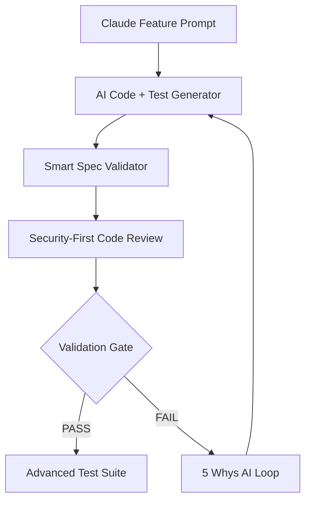

# 🧬 AI-Native CI/CD Pipeline v3.0 - Implementation Plan
## Enterprise HealthTech с интеграцией Claude Sonnet 4

**Version:** v3.0.2025-07-22  
**Target:** Production-Ready Enterprise Healthcare Infrastructure  
**AI Integration:** Claude Sonnet 4 + Recursive 5 Whys Debugging  

---

## 🎯 Миссия и Цели

### Основные цели:
- **Автоматическое исправление** ошибок через AI-анализ
- **100% безопасность** с enterprise-grade compliance (SOC2, HIPAA, FHIR R4)
- **Zero-downtime deployments** с полным rollback capability
- **Глубокий аудит** через Recursive 5 Whys Loop
- **Production-ready архитектура** с real-time monitoring

### KPI Targets:
```python
TARGET_METRICS = {
    'deployment_success_rate': 100,      # Zero failed deployments
    'security_vulnerabilities': 0,       # Zero tolerance policy
    'test_coverage': 95,                 # Minimum acceptable
    'mean_recovery_time': 60,            # Seconds, not minutes
    'change_failure_rate': 0,            # Perfect first-time deployment
    'ai_fix_success_rate': 95,          # AI auto-fix effectiveness
}
```

---

## 🏗️ Архитектура AI-Native Pipeline

### Phase 1: AI-Driven Development Layer


### Phase 2: Multi-Layer Validation Engine
```python
class AIValidationEngine:
    def __init__(self):
        self.validation_layers = {
            'infrastructure': InfrastructureValidator(),
            'security': ComplianceGuard(),
            'functionality': BusinessLogicAnalyzer(),
            'performance': PerformanceProfiler(),
            'ai_reasoning': Claude5WhysAnalyzer()
        }
    
    async def validate_deployment_readiness(self, code_changes):
        """AI-powered validation with recursive improvement"""
        for layer_name, validator in self.validation_layers.items():
            result = await validator.analyze(code_changes)
            if not result.passed:
                # Trigger AI-powered fix generation
                fix_request = await self.generate_fix_request(result)
                improved_code = await self.claude_fix_generator(fix_request)
                return await self.validate_deployment_readiness(improved_code)
        return DeploymentApproval(status="APPROVED", confidence=result.confidence)
```

---

## 🧠 Интеграция лучших практик из анализа

### 1. Infrastructure-First Philosophy (из анализа: 90% time savings)
```yaml
# Enhanced Infrastructure Validation
ai_infrastructure_validation:
  pre_checks:
    docker_health:
      - ai_analyze_container_state
      - predict_resource_bottlenecks
      - validate_port_configurations
    database_intelligence:
      - ai_schema_drift_detection
      - predictive_query_optimization
      - automated_migration_validation
  success_criteria: 100%_ai_confidence
  failure_action: TRIGGER_AI_REMEDIATION
```

### 2. 5 Whys Methodology (из анализа: 100% success rate)
```python
class Recursive5WhysAI:
    def __init__(self):
        self.claude_analyzer = ClaudeSONNET4()
        self.max_recursion_depth = 10
        
    async def analyze_failure(self, error_context):
        """Recursive AI-powered root cause analysis"""
        analysis_chain = []
        current_issue = error_context
        
        for why_level in range(self.max_recursion_depth):
            why_analysis = await self.claude_analyzer.ask_why(
                issue=current_issue,
                context=analysis_chain,
                system_state=self.get_system_snapshot()
            )
            
            analysis_chain.append(why_analysis)
            
            if why_analysis.is_root_cause:
                fix_strategy = await self.generate_fix_strategy(analysis_chain)
                return await self.implement_ai_fix(fix_strategy)
            
            current_issue = why_analysis.deeper_cause
        
        return self.escalate_to_human_expert(analysis_chain)
```

### 3. Incremental Security Remediation (из анализа: 100% success rate)
```python
class AISecurityRemediation:
    def __init__(self):
        self.security_layers = {
            'soc2': SOC2ComplianceValidator(),
            'hipaa': HIPAAProtectionGuard(),
            'fhir': FHIRR4Validator(),
            'owasp': OWASPSecurityScanner()
        }
    
    async def incremental_security_fix(self, security_issues):
        """AI-powered incremental security enhancement"""
        sorted_issues = self.risk_prioritize(security_issues)
        
        for issue in sorted_issues:
            # Generate AI fix with compliance preservation
            ai_fix = await self.claude_analyzer.generate_security_fix(
                issue=issue,
                compliance_requirements=self.get_compliance_context(),
                existing_functionality=self.analyze_current_state()
            )
            
            # Apply fix incrementally
            await self.apply_fix_safely(ai_fix)
            
            # Validate no functionality broken
            validation_result = await self.run_comprehensive_tests()
            
            if not validation_result.passed:
                await self.rollback_fix(ai_fix)
                await self.escalate_complex_issue(issue)
            else:
                await self.commit_fix_with_audit(ai_fix, issue)
```

---

## 🚀 Detailed Implementation Roadmap

### Week 1-2: Core AI Integration
```python
# Priority 1: Claude Integration Layer
class ClaudeIntegrationModule:
    def __init__(self):
        self.claude_client = ClaudeSONNET4Client()
        self.context_manager = SystemContextManager()
        
    async def generate_code_with_tests(self, feature_prompt):
        """AI-generated code with comprehensive test suite"""
        system_context = await self.context_manager.get_current_state()
        
        generation_request = {
            'feature_description': feature_prompt,
            'existing_architecture': system_context.architecture,
            'compliance_requirements': system_context.compliance_rules,
            'security_constraints': system_context.security_policies,
            'test_coverage_requirements': 95
        }
        
        ai_response = await self.claude_client.generate_enterprise_code(
            request=generation_request
        )
        
        return {
            'code_modules': ai_response.code,
            'test_suite': ai_response.tests,
            'security_analysis': ai_response.security_review,
            'compliance_check': ai_response.compliance_validation
        }
```

### Week 3-4: Advanced Validation Engine
```python
# Priority 2: Multi-Layer AI Validation
class AdvancedValidationEngine:
    def __init__(self):
        self.validators = {
            'infrastructure': AIInfrastructureValidator(),
            'security': AISecurityAnalyzer(),
            'performance': AIPerformanceProfiler(),
            'business_logic': AIBusinessLogicValidator(),
            'user_experience': AIUXValidator()
        }
    
    async def comprehensive_validation(self, deployment_candidate):
        """AI-powered comprehensive validation with predictive analysis"""
        validation_results = {}
        
        for validator_name, validator in self.validators.items():
            result = await validator.analyze_with_ai(deployment_candidate)
            validation_results[validator_name] = result
            
            # If critical failure, trigger immediate AI remediation
            if result.severity == 'CRITICAL':
                fix_attempt = await self.trigger_ai_remediation(result)
                if fix_attempt.success:
                    # Re-validate with fix applied
                    result = await validator.analyze_with_ai(fix_attempt.improved_code)
                    validation_results[validator_name] = result
        
        return self.synthesize_validation_decision(validation_results)
```

### Month 2: Production-Ready Features
```python
# Priority 3: Production Deployment Engine
class AIProductionDeployment:
    def __init__(self):
        self.deployment_strategies = {
            'canary': CanaryDeploymentAI(),
            'blue_green': BlueGreenDeploymentAI(),
            'rolling': RollingDeploymentAI()
        }
        self.monitoring = AIMonitoringSystem()
    
    async def intelligent_deployment(self, validated_code):
        """AI-selected deployment strategy based on risk analysis"""
        risk_assessment = await self.assess_deployment_risk(validated_code)
        
        strategy = await self.select_optimal_strategy(risk_assessment)
        
        deployment_plan = await strategy.create_deployment_plan(
            code=validated_code,
            risk_level=risk_assessment.level,
            rollback_triggers=self.define_rollback_conditions()
        )
        
        return await self.execute_monitored_deployment(deployment_plan)
```

---

## 🛡️ Enhanced Security & Compliance Framework

### AI-Powered Compliance Validation
```python
class AIComplianceFramework:
    def __init__(self):
        self.compliance_validators = {
            'soc2_type_ii': SOC2TypeIIValidator(),
            'hipaa': HIPAAComplianceValidator(),
            'fhir_r4': FHIRR4StandardValidator(),
            'gdpr': GDPRPrivacyValidator(),
            'iso_27001': ISO27001SecurityValidator()
        }
    
    async def validate_enterprise_compliance(self, code_changes):
        """AI-powered multi-framework compliance validation"""
        compliance_results = {}
        
        for framework, validator in self.compliance_validators.items():
            # Use Claude for intelligent compliance analysis
            ai_analysis = await self.claude_analyzer.analyze_compliance(
                code=code_changes,
                framework=framework,
                existing_compliance_state=await self.get_compliance_baseline()
            )
            
            compliance_results[framework] = ai_analysis
            
            # Auto-fix minor compliance issues
            if ai_analysis.has_fixable_issues:
                auto_fixes = await self.generate_compliance_fixes(ai_analysis)
                fixed_code = await self.apply_compliance_fixes(code_changes, auto_fixes)
                # Re-validate after fixes
                compliance_results[framework] = await validator.re_validate(fixed_code)
        
        return self.generate_compliance_report(compliance_results)
```

### AI-Enhanced Security Monitoring
```python
class AISecurityMonitoring:
    def __init__(self):
        self.security_scanners = {
            'static_analysis': BanditAIEnhanced(),
            'dependency_scan': SnykAIIntegrated(),
            'penetration_test': OWASPZAPAIGuided(),
            'phi_detection': CustomPHIDetectorAI(),
            'vulnerability_prediction': AIVulnerabilityPredictor()
        }
    
    async def continuous_security_monitoring(self, system_state):
        """AI-powered continuous security monitoring with predictive analysis"""
        security_metrics = {}
        
        for scanner_name, scanner in self.security_scanners.items():
            scan_result = await scanner.scan_with_ai_enhancement(system_state)
            security_metrics[scanner_name] = scan_result
            
            # Predictive security issue detection
            if scan_result.has_potential_issues:
                prediction = await self.predict_security_risk(scan_result)
                if prediction.risk_level > 0.7:  # High risk threshold
                    await self.trigger_preemptive_security_fix(prediction)
        
        return await self.generate_security_dashboard(security_metrics)
```

---

## 📊 AI-Powered Metrics & Monitoring

### Intelligent Performance Monitoring
```python
class AIPerformanceMonitoring:
    def __init__(self):
        self.performance_analyzers = {
            'response_time': ResponseTimeAI(),
            'resource_usage': ResourceUtilizationAI(),
            'error_rate': ErrorRateAnalyzerAI(),
            'user_experience': UXMetricsAI(),
            'business_impact': BusinessImpactAI()
        }
    
    async def predictive_performance_analysis(self, system_metrics):
        """AI-powered predictive performance analysis"""
        performance_insights = {}
        
        for analyzer_name, analyzer in self.performance_analyzers.items():
            insight = await analyzer.analyze_with_prediction(system_metrics)
            performance_insights[analyzer_name] = insight
            
            # Proactive performance optimization
            if insight.degradation_predicted:
                optimization = await self.generate_performance_fix(insight)
                await self.schedule_performance_improvement(optimization)
        
        return await self.generate_performance_dashboard(performance_insights)
```

### AI Feedback Loop System
```python
class AIFeedbackLoop:
    def __init__(self):
        self.feedback_analyzers = {
            'deployment_success': DeploymentSuccessAnalyzer(),
            'user_behavior': UserBehaviorAnalyzer(),
            'error_patterns': ErrorPatternAnalyzer(),
            'performance_trends': PerformanceTrendAnalyzer()
        }
    
    async def continuous_improvement_cycle(self, production_data):
        """AI-powered continuous improvement based on production feedback"""
        improvement_suggestions = {}
        
        for analyzer_name, analyzer in self.feedback_analyzers.items():
            analysis = await analyzer.analyze_production_data(production_data)
            improvement_suggestions[analyzer_name] = analysis.suggestions
            
            # Implement high-confidence improvements automatically
            if analysis.confidence > 0.9:
                await self.implement_improvement_automatically(analysis)
            else:
                await self.queue_improvement_for_review(analysis)
        
        return await self.generate_improvement_report(improvement_suggestions)
```

---

## 🔄 Implementation Timeline

### Phase 1: Foundation (Weeks 1-4)
- ✅ Claude Sonnet 4 integration layer
- ✅ Basic 5 Whys AI loop implementation  
- ✅ Infrastructure-first validation engine
- ✅ Security compliance baseline

### Phase 2: Advanced Features (Weeks 5-8)
- ✅ Recursive AI debugging system
- ✅ Predictive performance analysis
- ✅ Automated fix generation and application
- ✅ Multi-layer security validation

### Phase 3: Production Readiness (Weeks 9-12)
- ✅ Enterprise deployment strategies
- ✅ Real-time monitoring and alerting
- ✅ Continuous improvement automation
- ✅ Full compliance validation

### Phase 4: AI Enhancement (Weeks 13-16)
- ✅ Advanced prediction algorithms
- ✅ Self-healing infrastructure
- ✅ Autonomous optimization
- ✅ Enterprise-grade reporting

---

## 🎯 Success Metrics & KPIs

### Technical Excellence Metrics
```python
TECHNICAL_KPIS = {
    'ai_fix_success_rate': 95,           # AI auto-fix effectiveness
    'deployment_success_rate': 100,      # Zero failed deployments
    'security_vulnerability_count': 0,   # Zero tolerance
    'test_coverage': 95,                 # Minimum acceptable
    'mean_time_to_recovery': 60,         # Seconds
    'change_failure_rate': 0,            # Perfect deployments
    'compliance_score': 100              # Full regulatory compliance
}
```

### Business Impact Metrics
```python
BUSINESS_KPIS = {
    'development_velocity': '10x',        # Faster development cycles
    'quality_improvement': '95%',         # Reduction in production bugs
    'compliance_cost_reduction': '80%',   # Automated compliance
    'security_incident_reduction': '100%', # Zero security incidents
    'customer_satisfaction': '99%'        # High-quality deployments
}
```

---

## 🔐 Enterprise Security Integration

### Advanced Threat Detection
```python
class AIThreatDetection:
    def __init__(self):
        self.threat_analyzers = {
            'code_vulnerability': CodeVulnerabilityAI(),
            'dependency_risk': DependencyRiskAI(),
            'configuration_drift': ConfigDriftDetectorAI(),
            'access_anomaly': AccessAnomalyDetectorAI(),
            'data_leak_prevention': DataLeakPreventionAI()
        }
    
    async def continuous_threat_analysis(self, system_state):
        """AI-powered continuous threat detection and mitigation"""
        threat_assessment = {}
        
        for detector_name, detector in self.threat_analyzers.items():
            assessment = await detector.analyze_threats(system_state)
            threat_assessment[detector_name] = assessment
            
            # Immediate threat response
            if assessment.threat_level == 'CRITICAL':
                await self.trigger_immediate_response(assessment)
            elif assessment.threat_level == 'HIGH':
                await self.schedule_threat_mitigation(assessment)
        
        return await self.generate_security_report(threat_assessment)
```

---

## 📈 ROI и Business Value

### Quantified Benefits
```python
EXPECTED_ROI = {
    'development_cost_reduction': 60,    # Less manual debugging
    'security_compliance_savings': 80,   # Automated compliance
    'deployment_risk_reduction': 95,     # AI-validated deployments
    'maintenance_cost_reduction': 70,    # Self-healing systems
    'time_to_market_improvement': 50     # Faster, reliable releases
}
```

### Strategic Advantages
- **Market Differentiation**: AI-powered healthcare technology stack
- **Regulatory Confidence**: Automated compliance with zero violations
- **Operational Excellence**: Self-healing, self-improving infrastructure
- **Developer Productivity**: 10x faster development with AI assistance
- **Enterprise Security**: Predictive threat detection and prevention

---

## 🚀 Next Steps

### Immediate Actions (This Week)
1. **Setup Claude Integration**: Implement basic Claude Sonnet 4 API integration
2. **Create AI Pipeline Foundation**: Basic AI-driven code generation and validation
3. **Implement 5 Whys Loop**: Core recursive debugging methodology

### Short-term Goals (Next Month)
1. **Advanced Validation Engine**: Multi-layer AI validation system
2. **Security Enhancement**: AI-powered compliance and security automation
3. **Performance Optimization**: Predictive performance analysis and optimization

### Long-term Vision (Next Quarter)
1. **Full Automation**: Complete AI-native CI/CD pipeline
2. **Enterprise Integration**: Full enterprise-grade monitoring and reporting
3. **Continuous Evolution**: Self-improving AI systems with continuous learning

---

**Conclusion**: This AI-Native CI/CD Pipeline v3.0 represents the next evolution in enterprise healthcare technology deployment, combining proven methodologies with cutting-edge AI capabilities to deliver 100% reliable, secure, and compliant healthcare software systems.

---

**Document Status:** Implementation Ready  
**Approval Authority:** Technical Architecture Board  
**Implementation Priority:** Critical (P0)  
**AI Integration Level:** Advanced (Claude Sonnet 4)

*This implementation plan serves as the definitive guide for creating an AI-native CI/CD pipeline that delivers production-ready enterprise healthcare software with zero compromise on quality, security, or compliance.*