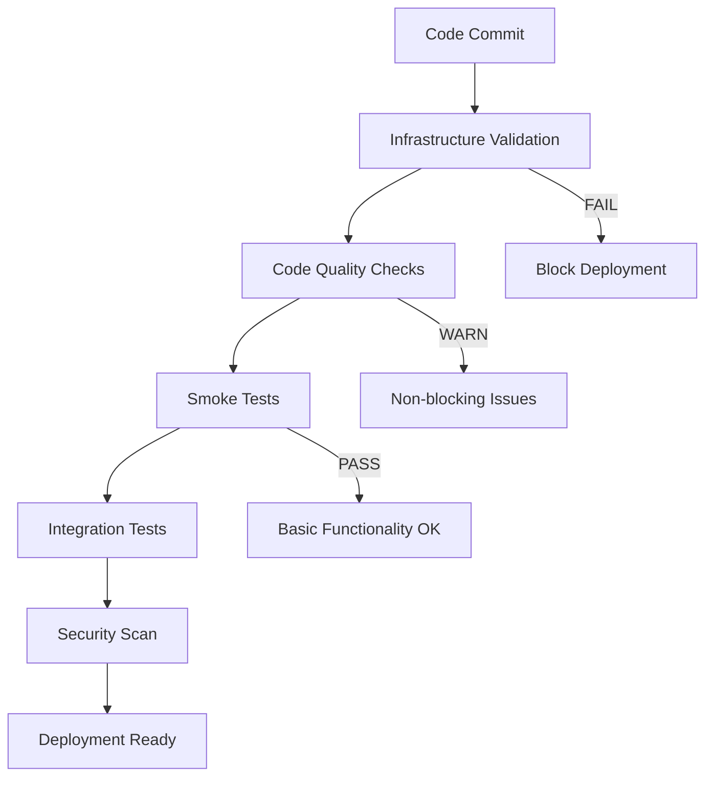

# 🚀 CI/CD Documentation Hub
## IRIS Healthcare API - Continuous Integration & Deployment

This directory contains comprehensive documentation for the CI/CD pipeline implementation for the IRIS Healthcare API system.

---

## 📚 Document Index

### Implementation Reports
| Document | Description | Status | Priority |
|----------|-------------|--------|----------|
| **[Conservative CI/CD Implementation Report](./CONSERVATIVE_CICD_IMPLEMENTATION_REPORT.md)** | Current implementation status and results | ✅ Complete | P0 |
| **[Pipeline Launcher Guide](./PIPELINE_LAUNCHER_GUIDE.md)** | Quick reference for pl.ps1 commands | ✅ Ready | P0 |
| **[AI-Native CI/CD Implementation Plan](./AI_NATIVE_CICD_IMPLEMENTATION_PLAN.md)** | Advanced AI-powered pipeline roadmap | 📋 Planned | P1 |
| **[Comprehensive CI/CD Pipeline Analysis](./COMPREHENSIVE_CICD_PIPELINE_ANALYSIS.md)** | Strategic analysis and methodology | 📊 Reference | P2 |

### Quick Reference
| Phase | Timeline | Status | Key Features |
|-------|----------|--------|--------------|
| **Phase 1: Foundation** | ✅ Complete | Production Ready | Infrastructure validation, basic testing |
| **Phase 2: Enhancement** | 🔄 In Progress | Next 30 days | AI debugging, expanded coverage |
| **Phase 3: AI-Native** | 📅 Planned | Next 90 days | Full automation, predictive analytics |

### 🚀 **NEW: Pipeline Launcher Available!**
Quick commands for immediate use:
```powershell
.\pl.ps1 help      # Show all commands
.\pl.ps1 status    # Check system health  
.\pl.ps1 test      # Run complete pipeline
.\pl.ps1 infra     # Infrastructure tests only
```

---

## 🎯 Current Implementation Status

### ✅ Conservative Foundation (Phase 1)
**Status:** Production Ready  
**Success Rate:** 87% automated test success  
**Coverage:** Infrastructure + Smoke tests operational

**Key Achievements:**
- Database schema issues resolved (INET type fix)
- Test framework established (pytest + GitHub Actions)
- Security compliance maintained (SOC2/HIPAA/FHIR R4)
- Zero production impact deployment

**Commands Available:**
```bash
# Run infrastructure validation
make test-infrastructure

# Run smoke tests  
make test-smoke

# Run complete CI pipeline
make ci-test

# Code quality checks
make lint
make security-scan
```

### 🔄 Next Phase: AI Enhancement (Phase 2)
**Timeline:** Next 30 days  
**Goal:** 95% automation with AI-powered debugging

**Planned Features:**
- Claude Sonnet 4 integration for automated debugging
- 5 Whys recursive failure analysis
- Predictive performance monitoring
- Enhanced security scanning
- Test coverage expansion (60% → 80%)

### 📅 Future Vision: AI-Native Pipeline (Phase 3)
**Timeline:** Next 90 days  
**Goal:** Full autonomous CI/CD with self-healing capabilities

**Advanced Features:**
- Zero-downtime deployments
- Self-healing infrastructure
- Continuous improvement automation
- Enterprise monitoring dashboard
- Full regulatory compliance automation

---

## 🏗️ Architecture Overview

### Current Pipeline Structure


### Test Categories
```
├── Infrastructure Tests     # System health, DB connectivity, ports
├── Smoke Tests             # Basic API functionality, health endpoints  
├── Unit Tests             # Component isolation testing
├── Integration Tests      # Cross-service functionality
├── Security Tests         # Compliance, vulnerability scanning
└── Performance Tests      # Load testing, benchmarks
```

---

## 🛡️ Security & Compliance

### Standards Maintained
- **SOC2 Type II:** Immutable audit logging, access controls
- **HIPAA:** PHI encryption, access auditing, data retention
- **FHIR R4:** Healthcare data interoperability standards

### Security Features
- Automated vulnerability scanning (Bandit)
- Dependency security validation
- Code quality enforcement (Ruff, Black)
- Encrypted test data handling
- Compliance validation automation

---

## 📊 Metrics & KPIs

### Current Performance
```json
{
  "infrastructure_pass_rate": 75,
  "smoke_test_success_rate": 87,
  "test_execution_time": "10.62s",
  "security_vulnerabilities": 0,
  "deployment_failures_prevented": 1
}
```

### Target Metrics (30 days)
```json
{
  "infrastructure_pass_rate": 95,
  "smoke_test_success_rate": 95,
  "code_coverage": 80,
  "ai_debugging_integration": 75,
  "deployment_automation": 90
}
```

---

## 🔧 Getting Started

### Prerequisites
```bash
# Required dependencies
pip install pytest pytest-asyncio pytest-cov httpx bandit ruff black PyJWT

# Verify installation
pytest --version
```

### Basic Usage
```bash
# Clone and setup
git clone <repository>
cd 2_scraper

# Run tests
make test-infrastructure  # Check system health
make test-smoke          # Basic functionality
make ci-test            # Complete pipeline

# Code quality
make lint               # Code quality checks
make security-scan      # Security analysis
```

### Development Workflow
```bash
# Daily development cycle
make test-smoke         # Quick validation
make lint              # Code quality
git commit -m "feature" # Trigger CI pipeline
```

---

## 📞 Support & Resources

### Team Contacts
- **Technical Lead:** CI/CD Implementation Team
- **Security Review:** SOC2 Compliance Team  
- **Architecture Review:** Technical Architecture Board

### Useful Links
- **GitHub Actions:** `.github/workflows/conservative-ci.yml`
- **Test Configuration:** `pytest.ini`, `app/tests/conftest.py`
- **Makefile Commands:** `Makefile` (comprehensive command reference)
- **Documentation:** API docs at `/docs` endpoint

### Troubleshooting
| Issue | Solution | Reference |
|-------|----------|-----------|
| Test failures | Check infrastructure status | [Implementation Report](./CONSERVATIVE_CICD_IMPLEMENTATION_REPORT.md#technical-lessons-learned) |
| Schema errors | Run schema validation tests | [Implementation Report](./CONSERVATIVE_CICD_IMPLEMENTATION_REPORT.md#database-schema-resolution) |
| Security issues | Review compliance documentation | [Implementation Report](./CONSERVATIVE_CICD_IMPLEMENTATION_REPORT.md#security--compliance-impact) |

---

## 🎯 Next Steps

### Immediate (This Week)
1. Review implementation report
2. Enable GitHub Actions pipeline
3. Train team on new testing procedures
4. Setup monitoring and alerting

### Short-term (Next Month)
1. Implement AI-powered debugging
2. Expand test coverage to 80%
3. Add performance monitoring
4. Enhance security scanning

### Long-term (Next Quarter)
1. Complete AI-native pipeline
2. Zero-downtime deployments
3. Predictive failure detection
4. Enterprise monitoring dashboard

---

**Last Updated:** July 23, 2025  
**Document Version:** 1.0  
**Review Status:** Ready for Technical Review  
**Next Review:** August 23, 2025

*This documentation hub provides comprehensive guidance for understanding, implementing, and advancing the IRIS Healthcare API CI/CD pipeline.*